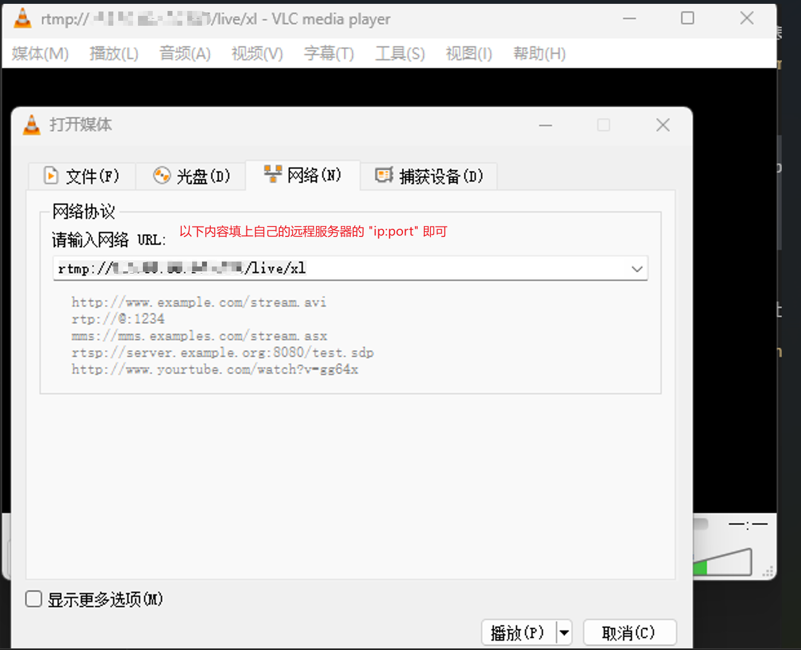

# 腾讯云nginx上搭建rtmp流媒体服务

以下假设我的腾讯云服务器的公网IP为：`MyTencentEcsIP`,实际上是从互联网服务提供商ISP那里分配到的以点分十进制的IP地址。
## nginx安装rtmp模块
### 模块准备
模块的官网地址
* `nginx`
    * 下载地址: `http://nginx.org/en/download.html`，这里我选择的是`nginx-1.24.0.tar.gz`的`stable`版本，完整下载链接为:`https://nginx.org/download/nginx-1.24.0.tar.gz`
* `nginx-rtmp-module`
    * 下载地址: `https://github.com/arut/nginx-rtmp-module/`,这里我选择的`Tags`是`v1.2.2.tar.gz`，完整下载链接为`https://github.com/arut/nginx-rtmp-module/archive/refs/tags/v1.2.2.tar.gz`

实例步骤
* 进入到`/usr/src`目录：`cd /usr/src`
* 下载`nginx`，这里选择的是`1.24.0`版本,下载的是压缩包：`sudo wget https://nginx.org/download/nginx-1.24.0.tar.gz`
* 下载`nginx-rtmp-module`组件，下载的是压缩包：`sudo wget https://github.com/arut/nginx-rtmp-module/archive/refs/tags/v1.2.2.tar.gz -O nginx-rtmp-module.tar.gz`
* 解压： `sudo tar -zxvf nginx-1.24.0.tar.gz`
* 解压： `sudo tar -zxvf nginx-rtmp-module.tar.gz`
### 环境准备
以下是下载`nginx`与`nginx-rtmp-module`，以及编译`nginx`所需要的一些包。如果之前安装过可以忽略，没有安装过则需要执行以下命令进行安装。
* `sudo apt update`
* `sudo apt-get upgrade`
* `sudo apt install build-essential`
* `sudo apt install libpcre3 libpcre3-dev`: `nginx-rtmp-module-1.2.2`需要这个库
* `sudo apt-get install gcc g++` ： 编译需要这个工具
* `sudo apt-get install zlib1g-dev`： `http`需要这个库
* `sudo apt-get install libssl-dev`

### 如果之前安装过nginx，则根据需求可以先卸载原有nginx
如果之前安装过`nginx`可以选择先卸载
1. 检查`nginx`是否处于运行状态: `ps aux | grep nginx`
2. 如果在运行，先停止: `sudo systemctl stop nginx`
3. 卸载`nginx`: `sudo apt-get remove nginx`
4. 获取`nginx`相关文件所在目录: `whereis nginx`
5. 删除`nginx`配置文件和目录
    * `sudo rm -rf /etc/nginx`
    * `sudo rm -rf /usr/sbin/nginx`
    * `sudo rm -rf /usr/lib/nginx`
    * `sudo rm -rf /usr/share/nginx`
    * `sudo rm -rf /usr/share/man/man8/`
    > 以上目录和文件是`whereis nginx`查询出来的


## 配置nginx-rtmp-module，编译出带有rtmp模块的nginx可执行文件
* `cd nginx-1.24.0`
* `sudo ./configure --add-module=../nginx-rtmp-module-1.2.2`
    > 增加`ssl`支持执行这条命令： `sudo ./configure --with-http_ssl_module --add-module=../nginx-rtmp-module-1.2.2`
* `sudo make`
* `sudo make install`: 安装编译好的软件到操作系统中。
    > 以上两个命令在同一目录下执行即可，`make install`执行结束后会在路径`/usr/local/`目录下生成`nginx`目录,该目录下放置了`nginx`的相关资源
* `sudo /usr/local/nginx/sbin/nginx`: 启动`nginx`
* `ps aux | grep nginx`: 检查`nginx`是否启动
* 如果对`nginx`的文件有修改比如`html`目录下的`index.html`文件，运行`sudo nginx -s reload`命令重新加载资源，然后访问公网`IP`看看修改有无生效
* 存在的问题
    * `sudo nginx -s reload`执行一直失败，报错如下:
        ```
        nginx.service is not active, cannot reload.
        ```
* 解决方法
    * 先停止：`sudo systemctl stop nginx`
    * 再启动：`sudo systemctl start nginx`
    * 再次访问公网`IP`地址，刷新浏览器看看修改后的结果，虽然界面确实发生变化了，但是还是会有以下提示，不知是否是`error`,`TODO`: 进一步探究
        ```
        Job for nginx.service failed because the control process exited with error code.
        See "systemctl status nginx.service" and "journalctl -xeu nginx.service" for details.
        ```
    > 启动前可以执行命令`./nginx -t`检查`nginx`的配置文件是否存在语法错误,因为`path`目录没有配置`nginx`可执行文件的路径或者即使配置了也会出现`Command 'nginx' not found`的错误，所以这里需要在命令执行前加上`./`
* 另外一种解决办法
    * `sudo ./nginx -s reload`: 必须在`nginx`可执行文件的路径下执行，并且必须在前面加上`./`，且必须使用`sudo`来提升权限

## nginx关于rtmp的配置
在`/usr/local/nginx/conf/nginx.conf`中进行配置,增加如下内容:
```
rtmp {  
    server {  
        listen 1935;   # 1935是rtmp默认的端口
        application live {  
            live on;  
        }
    }  
}
```
* 查看`nginx.conf`文件的内容： `cat nginx.conf`
* 配置完成，在`nginx`可执行文件目录下执行`sudo ./nginx -s reload`, 使得配置生效
* 由于我们的`linux`服务器是开启了防火墙的，所以要允许`1935`这个端口有流量通过，并且由于我们是使用`ufw`来作为我们的防火墙，所以待执行命令为: `sudo ufw allow 1935`
> 注意：`rtmp`要独立配置和`nginx.conf`中的`http`模块是同级关系
## 推流与拉流
背景：
`rtmp`部署在我的远程`linux`服务器上，我想在我本地的`windows`主机上往远程`linux`服务器进行推流。可以使用`ffmpeg`来进行推流。

### ffmpeg
#### 核心库简介
以下罗列了`FFmpeg`多媒体框架中的七个核心库，这些库组成的多媒体框架提供了一套功能齐全、高效稳定的音视频处理方案，被广泛地应用于音视频领域。它们分别是：
* `libavutil`：提供了其他库使用的公共函数，包括数据结构、算法、数学函数等。
* `libswscale`：提供了视频像素格式转换和缩放的函数。
* `libswresample`：提供了音频采样格式转换和重采样的函数。
* `libavcodec`：提供了音频和视频编解码器的实现。
* `libavformat`：提供了音视频封装和解封装器的实现，能够读取和写入各种音视频容器格式。
* `libavdevice`：提供了音视频设备的输入和输出接口，包括摄像头、麦克风等。
* `libavfilter`：提供了音视频滤镜的功能，可以对音视频数据进行处理和增强。
这些库相互依赖，通过协同工作完成音视频处理任务。例如，当需要从音视频文件中读取数据时，`libavformat`提供了相关接口读取音视频文件的数据，`libavcodec`对读取到的数据进行解码，最后经过`libswresample（或libswscale）`转换格式后输出。又例如，当需要对视频进行缩放时，`libswscale`提供了相应的函数进行像素的格式转换和缩放。
#### linux客户端推流到linux服务器
这条`linux`上的推流命令还没有经过实践自己认证，`https://bbs.huaweicloud.com/blogs/364975`，是从该网站上摘录而来
```
ffmpeg -thread_queue_size 128 -f video4linux2 -r 12 -s 1280x720 -i /dev/video0 -f alsa -i default -ar 44100 -ac 1 -f mp3 -qscale 5 -vcodec libx264 -acodec aac -f flv "rtmp://MyTencentEcsIP/live/xl"
```
* `-thread_queue_size 128`：设置线程队列的大小，默认值为`8`，可以根据需要适当调整
* `-f video4linux2`：指定视频输入格式，此处为`Linux`视频设备驱动
* `-r 12`：设置视频帧率，此处为`12帧/秒`
* `-s 1280x720`：设置视频分辨率，此处为`1280x720像素`
* `-i /dev/video0`：指定视频输入源，此处为系统第一个摄像头设备
* `-f alsa`：指定音频输入格式，此处为`Linux`音频设备驱动
* `-i default`：指定音频输入源，此处为系统默认音频设备
* `-ar 44100`：设置音频采样率为`44.1kHz`
* `-ac 1`：设置音频通道数为1（单声道）
* `-f mp3 -qscale 5`：将音频编码为`MP3`格式，设置质量为`5`
* `-vcodec libx264`：将视频编码为`H.264`格式
* `-acodec aac`：将音频编码为`AAC`格式
* `-f flv`：设置输出格式为`FLV`
* `"rtmp://MyTencentEcsIP:1935/live/xl"`：指定输出的`RTMP`服务器地址和推流路径，此处地址为远程`linux`服务器配置的rtmp服务地址`MyTencentEcsIP`，端口为`1935`，推流路径为`/live/xl`
    > 如果`nginx`安装在公网服务器上, 这里可以使用公网`ip`，我这里就用了我的公网`IP`

#### windows客户端推流到远程服务器
* 先检测本地摄像头是否可用
    * `ffmpeg -list_devices true -f dshow -i dummy`: 使用`ffmpeg`显示设备列表
    * `ffmpeg -f dshow -i video="Logitech Webcam C270" -t 5 -y output.mp4`: 使用`ffmpeg`检查设备状态，比如`Logitech Webcam C270`就是上面的命令执行结果中的某一个。如果设备正常，则在当前目录下会有一个`output.mp4`的文件，该文件就是一个保存了`5s`实时视频的文件。
* 在可用的情况下，输入以下命令，推流本地视频到远程服务器
    ```shell
    ffmpeg -f dshow -i video="Integrated Webcam_FHD" -vcodec libx264 -preset ultrafast -tune zerolatency -s 1280x720 -pix_fmt yuv420p -r 30 -g 60 -b:v 2500k -f flv rtmp://MyTencentEcsIP/live/xl
    ```

#### 使用开源软件OBS进行直播推流
可以将计算机桌面内容推流到远程linux服务器，拉流用户可以看到推流内容。

`OBS`设置
    * 设置
        * 直播
            * 服务：`自定义`
            * 服务器: `rtmp://MyTencentEcsIP/live`
            * 推流码: `xl`
#### windows客户端从远程服务器拉取刚才推的直播流，到本地显示
这里采取的方案是：使用一个免费的拉流软件来对视频流进行拉取，然后在`Windows`客户端上进行显示。

我选择是`vlc-3.0.18-win64.exe`，下载地址是: `https://get.videolan.org/vlc/3.0.18/win64/vlc-3.0.18-win64.exe`

下载完成后进行安装，安装后在该软件中配上拉流地址`rtmp://MyTencentEcsIP/live/xl`即可。
详细细节如下图所示:

## 参考链接
* `Linux`下`nginx`搭建`rtmp`服务: [https://bbs.huaweicloud.com/blogs/364975](https://bbs.huaweicloud.com/blogs/364975)
* `FFmpeg`: [https://ffmpeg.org/documentation.html](https://ffmpeg.org/documentation.html)