# prometheus+grafana搭建微服务监控系统
## 简介
本项目主要演示如何使用prometheus和grafana来对微服务系统的服务进行一个监控。整个项目主要包括以下一个部分：
* 微服务的开发
* 微服务Docker镜像的制作
* Docker部署开发的微服务、prometheus以及grafana
* 效果演示

## 技术选型
* web框架: github.com/gin-gonic/gin
* 测试框架: github.com/go-resty/resty/v2
* prometheus客户端采集sdk: github.com/prometheus/client_golang
* 服务镜像构建: Dockerfile
* 服务部署：docker-compose
* 指标展示：prometheus
* 全局监控: grafana

## 微服务开发
这里主要简单的提供两个微服务，其主要功能是作为一个http服务器。两个服务均提供`get`请求`/hello`供客户端访问。

服务代码详见：`cmd/service1/main.go`与`cmd/service2/main.go`

测试代码详见：`cmd/service1/test/api_test.go`与`cmd/service2/test/api_test.go`

### prometheus采集监控数据
* 自己简单封装了一个采集模块，详见`sdk/prometheus/exporter.go`
* 集成,详见`cmd/service1/main.go`与`cmd/service2/main.go`
    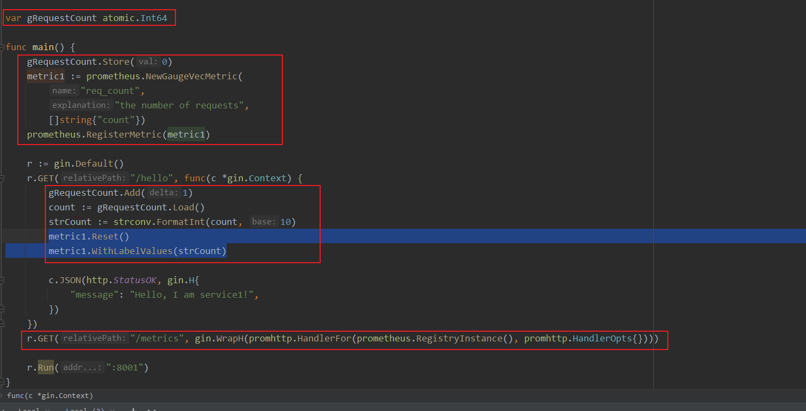
    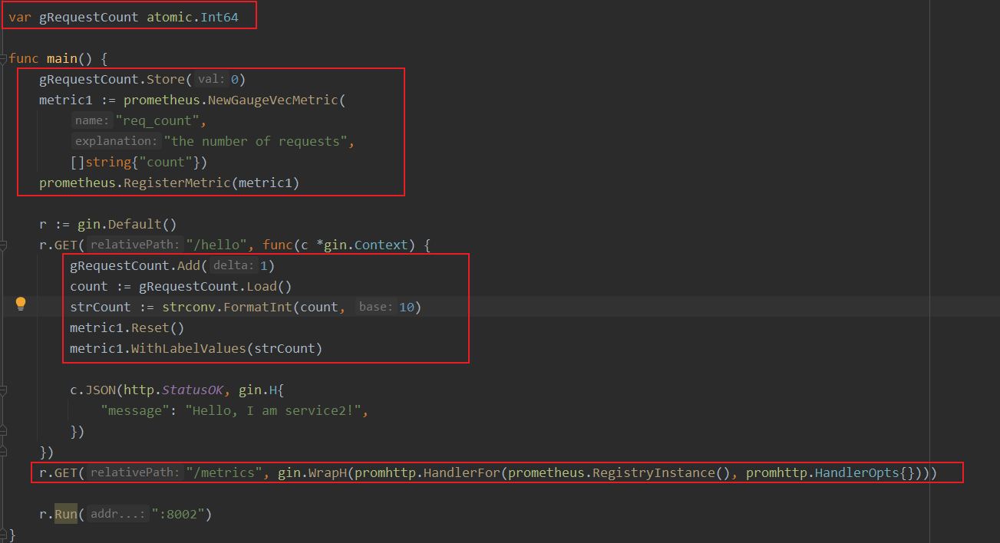
* 客户端每访问一次`/hello`接口，都更新监控指标。

## 服务镜像构建
服务一的镜像构建脚本文件详见`./cmd/service1/Dockerfile`

服务二的镜像构建脚本文件详见`./cmd/service2/Dockerfile`

## 服务部署
服务部署的文件详见`./docker-compose.yml`

## 全局监控
### 配置要监控的服务
要监控的服务，详见容器`prometheus`的配置文件`prometheus-config.yml`。该文件间中配置监控了两个服务：`service1`和`service2`。
### grafana监控
1. 访问地址`http://localhost:3000/login`登录进系统，默认账号名密码是：`admin admin`
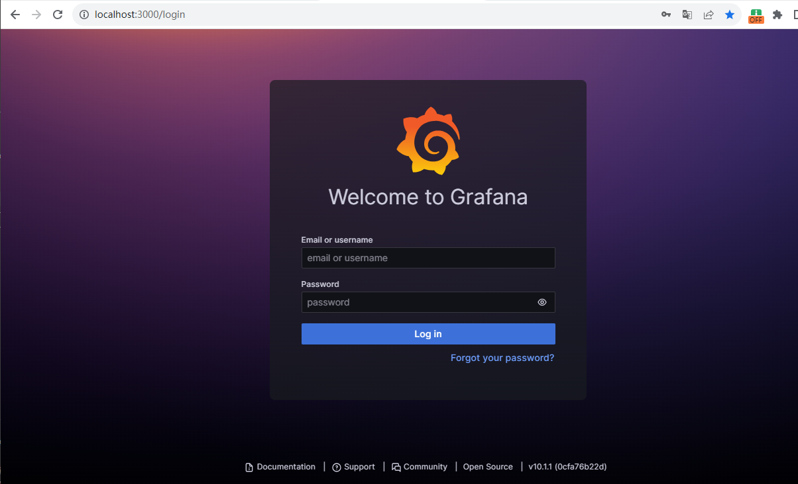
2. 登录成功后设置数据来源，即`prometheus`。
    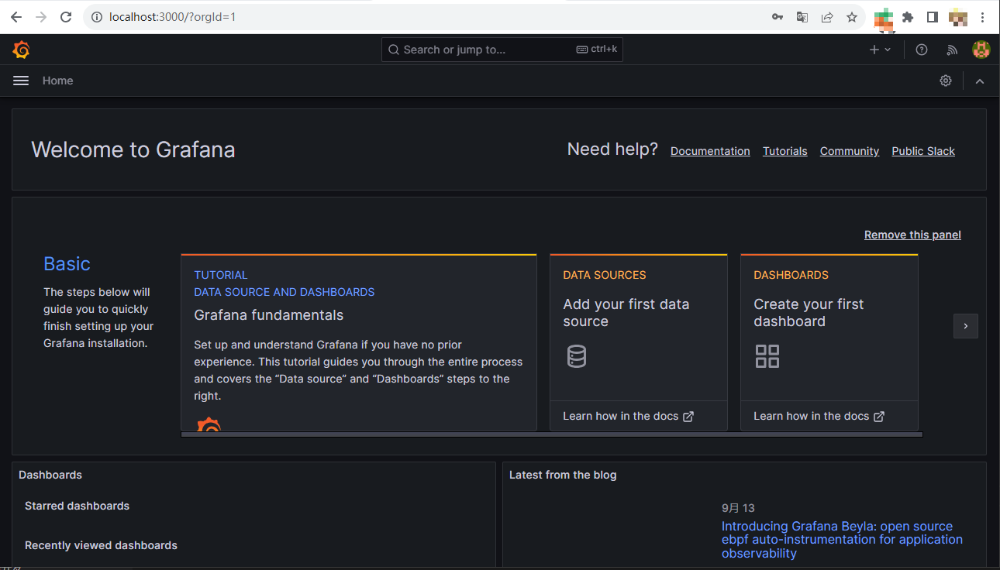
    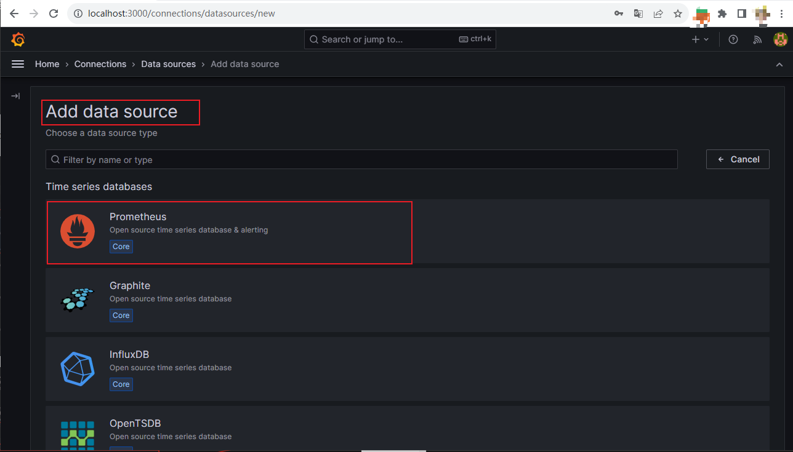
    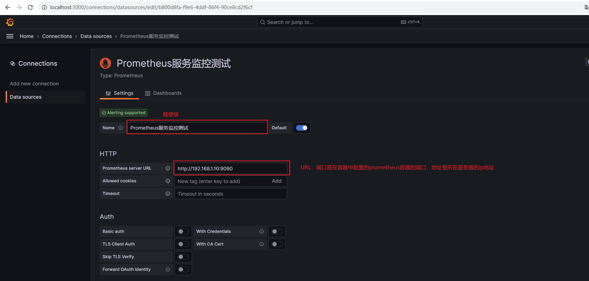
    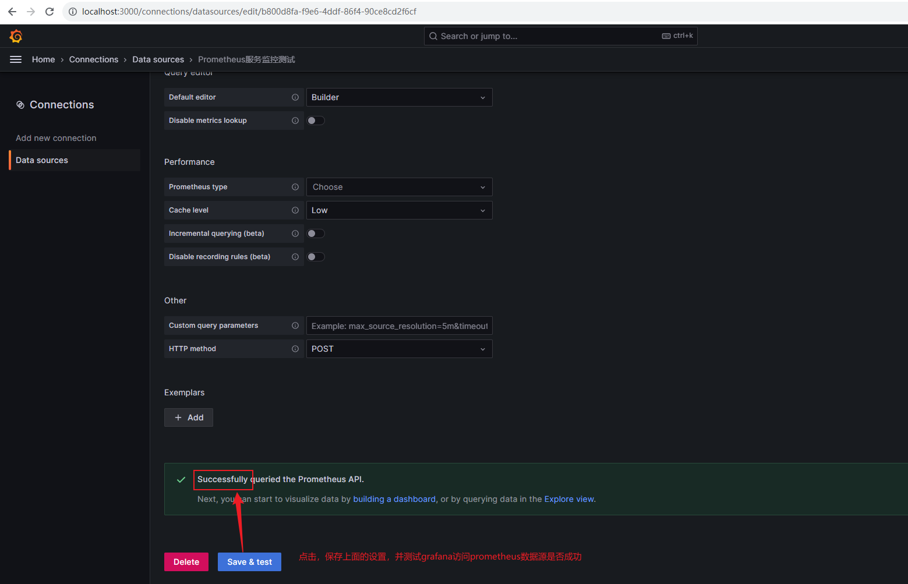
3. 增加控制面板，查看监控数据，在`grafana`中叫做`Dashboards`
    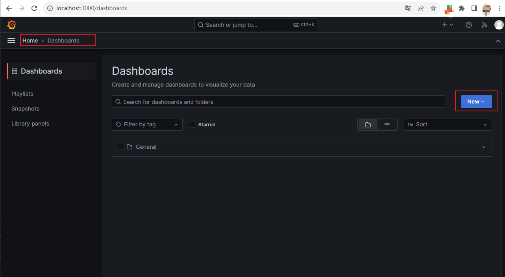
    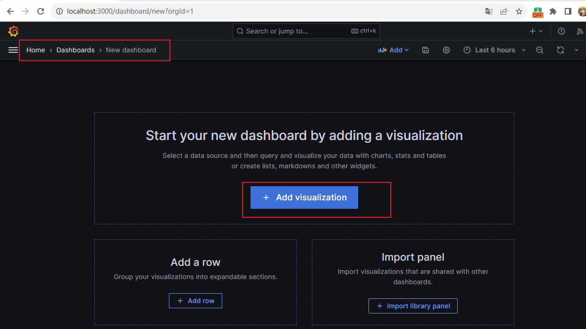
    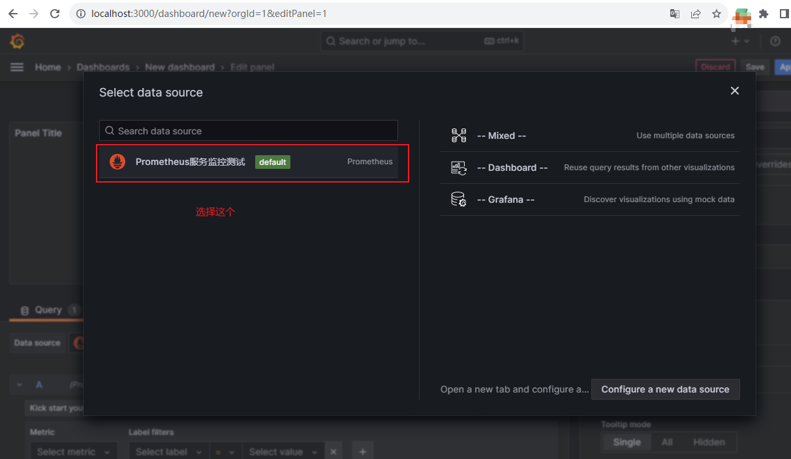
    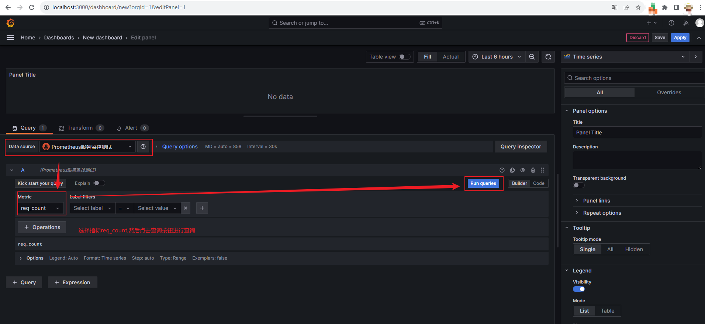
    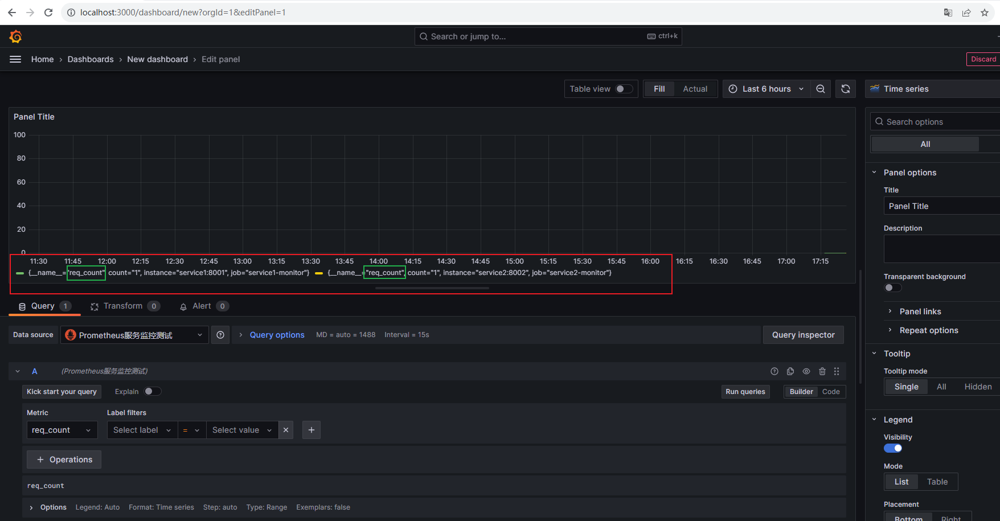
    > 存在的问题，在两个服务的源码中，我们取了相同的`name`,即`req_count`。即有两个服务进程，往同一个`name`去写数据，而且写的是进程自己管理的数据，所以会存在互相覆盖的情况。所以后续需要自己注意一下！！！

## 源码
* 地址：[luweiqianyi/go/metrics](https://github.com/luweiqianyi/go/tree/master/metrics)