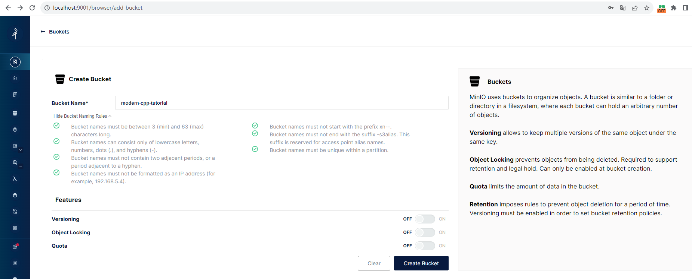
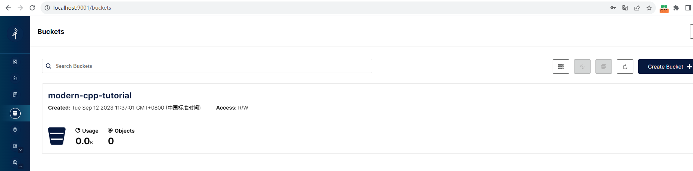
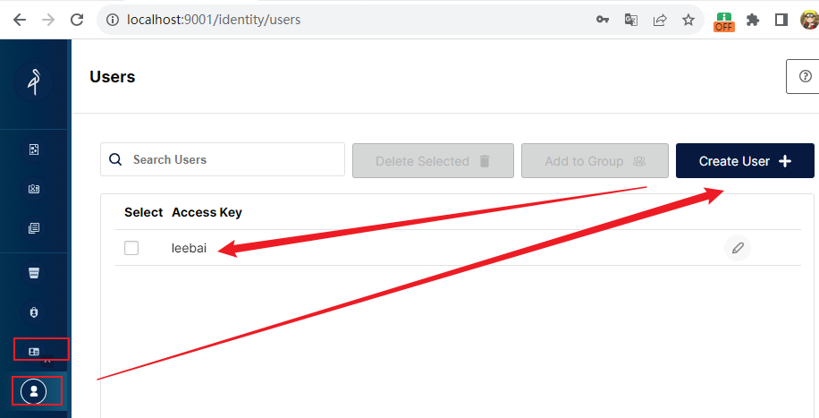
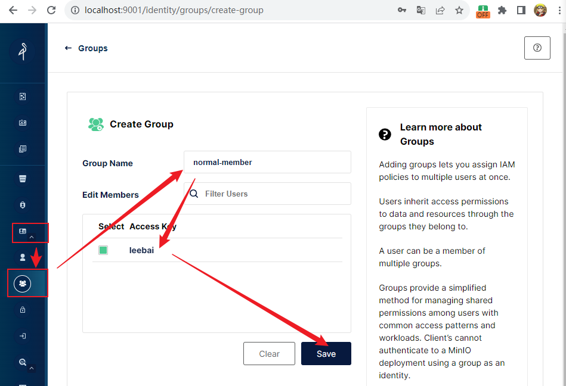
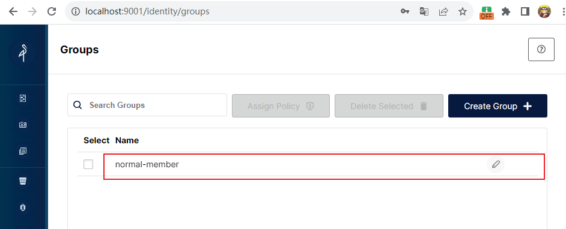
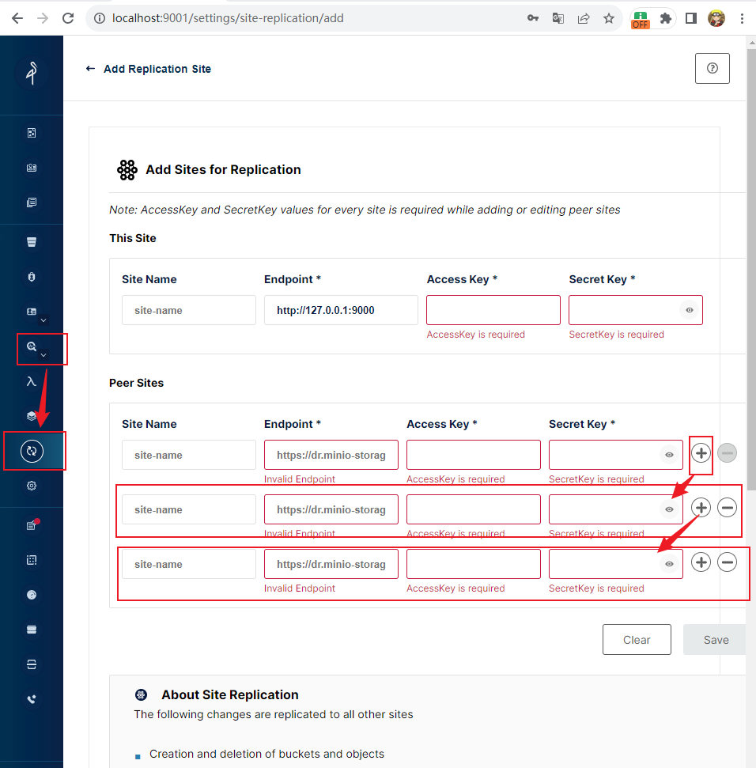

# MinIO简介
## 是什么
根据官网介绍，`MinIO`是一个高性能的、和`Amazon S3`兼容的对象存储。为了大规模`AI/ML`、数据湖、数据库工作负载而建。可以在任何云或者本地基础设施上运行。

## MinIO Docker部署 单节点版本
### docker-compose.yml
```yml
version: '2'

services:
  minio:
    image: minio/minio
    container_name: minio_server
    hostname: "minio"
    ports:
      - '9000:9000'
      - '9001:9001'
    volumes:
      - ./data:/data
      - ./config:/root/.minio/
    environment:
      - MINIO_ACCESS_KEY=admin
      - MINIO_SECRET_KEY=12345678
    command: server --console-address ':9001' /data  #指定容器中的目录 /data
```
> 注意：以上账号名和密码的配置的要求是“账号名必须至少有3个字符，密码必须至少有8个字符”，否则容器应用无法启动

> 9000是minio服务端的访问端口
> 9001是minio web管理平台的访问端口
### 部署脚本
```shell
docker-compose up -d
```
### 访问
浏览器输入`http://localhost:9001/`即可，在登录界面输入上面`docker-compose.yml`文件中配置的账号名和密码即可。
## 组件
### Buckets
`MinIO`使用`Buckets`来管理对象。`Buckets`可以理解为一个文件系统中的目录。每一个`Bucket`可以持有一组任意数量的对象。
#### 创建一个Bucket

> bucket的命名规则图中已告知
#### 查看bucket

### IAM Policies
`MinIO`使用 `Policy-Based Access Control(PBAC)`来定义用户对于授权行为和资源的访问权限。兼容AWS的IAM。
> IAM: 全称Indentity and Access Management。

#### 默认Policy
* `consoleAdmin`
* `diagnostics`
* `readonly`
* `readwrite`
* `writeonly`

以`consoleAdmin`为例：
```json
{
    "Version": "2012-10-17",
    "Statement": [
        {
            "Effect": "Allow",
            "Action": [
                "admin:*"
            ]
        },
        {
            "Effect": "Allow",
            "Action": [
                "kms:*"
            ]
        },
        {
            "Effect": "Allow",
            "Action": [
                "s3:*"
            ],
            "Resource": [
                "arn:aws:s3:::*"
            ]
        }
    ]
}
```
* 第一个表示允许执行以`admin:`为前缀的所有操作。这可能是与自定义的用户或服务相关的操作
* 第二个表示允许执行以`kms:`为前缀的所有操作。这是与`AWS Key Management Service`相关的操作，允许对密钥进行管理、创建和使用。
* 第三个表示允许执行以`s3:`为前缀的操作，并且资源限定为`arn:aws:s3:::*`,即允许所有s3存储桶的操作。包括创建、删除、查询等。

### Identity
#### Users
用户账号管理。

新增使用本系统的账户，并授予上面说到的`Policy`权限。
#### Groups
组。同一组中的用户拥有相同的`Policy`。
创建组如下：

> 我这里创建一个叫做"普通会员"的组，当然还可以创建"超级大会员"组，吐槽一句，互联网恶心的会员去广告还能看到广告的厂商大家记得坚决抵制哦，明显就是把消费者当韭菜割o(╥﹏╥)o

创建完成后


#### OpenID
待实战后补充。

#### LDAP
待实战后补充。

### Monitor
#### Event Destination
MinIO bucket通知允许administrator就某些对象或存储桶事件向支持的外部服务发送通知。

具体详情，待实战后补充。
#### Tiers
该对象主要用来进行存储对象声明周期的管理。

具体详情，待实战后补充。

#### Site Replication
主要作用于整个MinIO站点。进行站点的复制，猜测是为了高可用而设计的。

