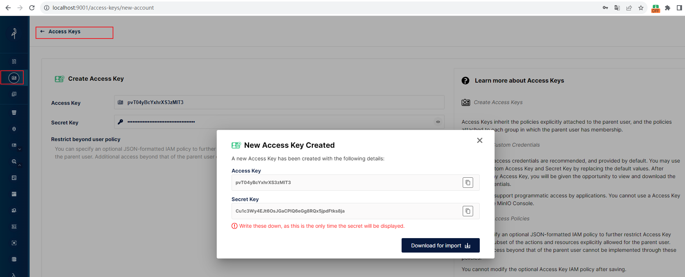

# go操作MinIO
## 在后台服务端创建accessKey和secretAccessKey



## 功能测试
### 测试能否正常连接到后台minio server
#### 测试代码
```go
package test

import (
	"fmt"
	"github.com/minio/minio-go/v7"
	"github.com/minio/minio-go/v7/pkg/credentials"
	"testing"
)

const (
	endpoint        = "localhost:9000"
	accessKeyID     = "pvT04yBcYxhrXS3zMIT3" // 这里就是上面的步骤中在minio服务端生成的
	secretAccessKey = "Cu1c3Wy4EJt6OsJGaCPIQ6eGg8RQx5jpdFtks8ja"// 这里就是上面的步骤中在minio服务端生成的
	useSSL          = false
)

func TestConnect(t *testing.T) {
	minioClient, err := minio.New(
		endpoint,
		&minio.Options{
			Creds:  credentials.NewStaticV4(accessKeyID, secretAccessKey, ""),
			Secure: useSSL,
		},
	)

	if err != nil {
		fmt.Printf("connect to remote minio server failed, err: %v", err)
	}

	fmt.Printf("connect to remote minio server success, client info: %v", minioClient)
}
```
#### 测试结果
```log
=== RUN   TestConnect
connect to remote minio server success, client info: &{0xc000140120 0xc0000da180 0 { } false 0xc00016d200 <nil> 0xc000096de0 false false <nil>   0xc00016d260 0 0x1142940 0x11429e0 -1 false}--- PASS: TestConnect (0.00s)
PASS
```

### 代码创建一个bucket
#### 测试代码
这里我们用代码访问远端的minio服务端，并创建一个bucket，而不是自己直接在后台创建。
```go
func TestMakeBucket(t *testing.T) {
	ctx := context.Background()

	minioClient, err := minio.New(endpoint, &minio.Options{
		Creds:  credentials.NewStaticV4(accessKeyID, secretAccessKey, ""),
		Secure: useSSL,
	})
	if err != nil {
		log.Fatalln(err)
	}

	bucketName := "music"
	location := "cn-zj-1" // 中国浙江一区

	err = minioClient.MakeBucket(ctx, bucketName, minio.MakeBucketOptions{Region: location})
	if err != nil {
		exists, errBucketExists := minioClient.BucketExists(ctx, bucketName)
		if errBucketExists == nil && exists {
			log.Printf("We already own %s\n", bucketName)
		} else {
			log.Fatalln(err)
		}
	} else {
		log.Printf("Successfully created %s\n", bucketName)
	}
}
```
#### 测试结果
```log
=== RUN   TestMakeBucket
2023/09/12 15:04:18 Successfully created music
--- PASS: TestMakeBucket (0.05s)
PASS
```
#### 去后台验证


如图所示，确实生成了`bucket`。

### 代码上传一个压缩文件到刚创建的bucket
#### 测试代码
```go
func TestUploadZip(t *testing.T) {
	ctx := context.Background()

	minioClient, err := minio.New(endpoint, &minio.Options{
		Creds:  credentials.NewStaticV4(accessKeyID, secretAccessKey, ""),
		Secure: useSSL,
	})
	if err != nil {
		log.Fatalln(err)
	}

	bucketName := "music"

	// Upload the zip file
	objectName := "test.zip"
	filePath := "./test.zip"
	contentType := "application/zip"

	info, err := minioClient.FPutObject(ctx, bucketName, objectName, filePath, minio.PutObjectOptions{ContentType: contentType})
	if err != nil {
		log.Fatalln(err)
	}

	log.Printf("Successfully uploaded %s of size %d\n", objectName, info.Size)
}
```
#### 测试结果
```log
=== RUN   TestUploadZip
2023/09/12 15:14:37 Successfully uploaded test.zip of size 144
--- PASS: TestUploadZip (0.09s)
PASS
```
#### 后台验证


如上所示，文件确实传上去了。

## 参考
* 其他API的使用详见：[minio-go](https://github.com/minio/minio-go)