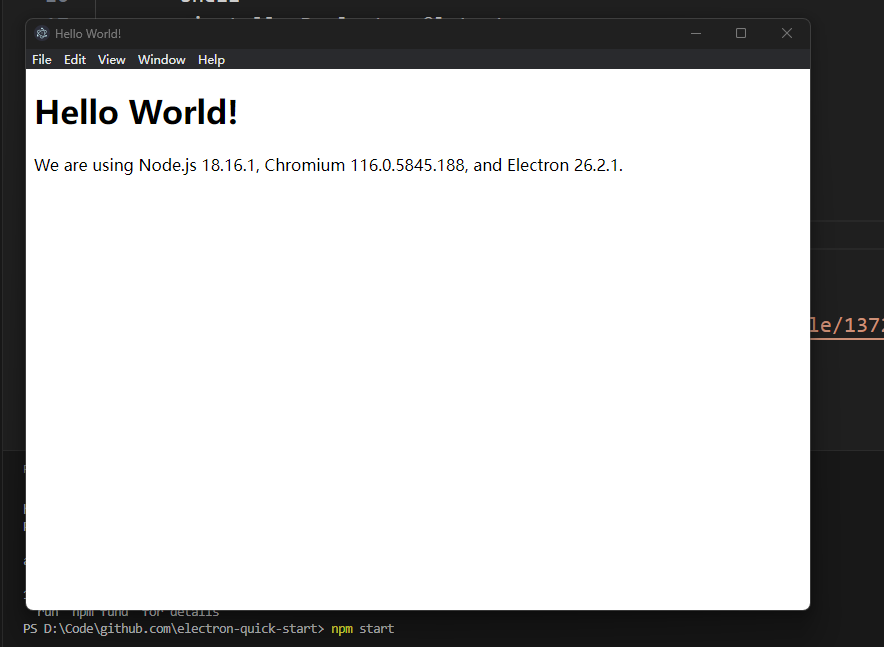

# electron入门
## 环境准备
* `npm`配置国内镜像源，这里配置成淘宝源
    ```shell
    npm config set registry https://registry.npmmirror.com
    ```
* 验证上述配置是否成功
    ```shell 
    npm config get registry
    ```
* 下载一个初始项目，自己不用再写一些基本代码
    ```shell
    git clone https://github.com/electron/electron-quick-start .
    ```
* 安装`electron`包
    ```shell
    npm install -D electron@latest
    ```
* 运行
    ```shell
    npm start
    ```
* 效果
    

## 参考链接
* npm配置国内源： [https://cloud.tencent.com/developer/article/1372949](https://cloud.tencent.com/developer/article/1372949)