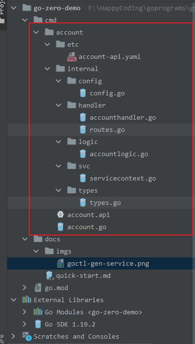
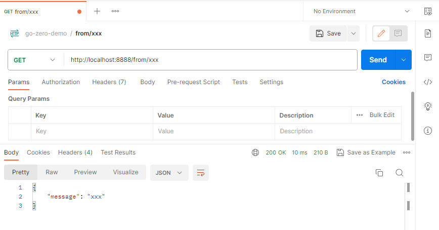

# go-zero-demo quick start
## 环境准备
1. goland新建项目，取名`go-zero-demo`
2. `go-zero-demo`同级目录创建目录`go-zero-demo-gopath`, 设置`GOPATH`为`go-zero-demo-gopath`
3. `go-zero-demo`下创建`cmd`目录，放置服务源码,`cmd`下以服务名称建立各文件夹，放置对应服务的源码，比如
    ```shell
    go-zero-demo
    ├── cmd
    │   ├── account （账号服务: 负责账号管理, 后续由goctl脚手架自动生成）
    │   │   └── account.go
    │   │
    │   ├── user （用户服务: 负责用户信息管理）
    │   ├── vuepress-tutorial
    │   │   └── README.md
    │   └── config.md
    │
    ├── docs
    │   └──quick-start.md
    │
    ├── go.mod
    └── go.sum
    ```
4. 打开终端(Terminal)，输入命令`go get -u github.com/zeromicro/go-zero@latest`安装`go-zero`框架。后续微服务的开发皆基于此框架进行开发。
5. 安装`goctl`脚手架，用于一键生成代码、文档、部署 k8s yaml、dockerfile 等。
    ```
    go install github.com/zeromicro/go-zero/tools/goctl@latest
    ```
    > 下载完成后会在`gopath`的`bin`出现`goctl`的可执行文件，同时需要将它的路径添加到环境变量中，以便于命令行能够识别
6. 利用`goctl`安装`grpc`相关的组件: `protoc`,`protoc-gen-go`,`protoc-gen-go-grpc`
    ```
    goctl env check --install --verbose --force
    ```
    安装成功输出
    ```
    [goctl-env]: preparing to check env

    [goctl-env]: looking up "protoc"
    [goctl-env]: "protoc" is installed

    [goctl-env]: looking up "protoc-gen-go"
    [goctl-env]: "protoc-gen-go" is installed

    [goctl-env]: looking up "protoc-gen-go-grpc"
    [goctl-env]: "protoc-gen-go-grpc" is installed

    [goctl-env]: congratulations! your goctl environment is ready!
    ```

## demo开发
1. `Terminal`进入`cmd`目录
2. 使用`goctl`生成`account`服务,命令: `goctl api new account`, 执行结果如图所示:
    
3. `go mod tidy`下载该服务所需依赖
4. 修改业务代码，具体做以下修正，通过git的修改记录可以看到本次修改内容，这里只是简单介绍一下
    * 生成代码的配置文件路径配置错误，程序加载不进来，所以对`account.go`进行对应修改
    * 实际的业务逻辑在`logic/accountlogic.go`目录中，这里随便加个响应返回即可,比如我这里随便加的代码如下所示
        ```go
        func (l *AccountLogic) Account(req *types.Request) (resp *types.Response, err error) {
            resp = new(types.Response)
            resp.Message = req.Name
            return
        }
        ```
5. 修改完成后,编译,运行即可
6. 启动后服务会监听`8888`端口,端口配置在`account-api.yaml`中配置。
7. 修改某些文件,将接口中的限制`,options=you|me`去掉, 具体修改看git本次提交记录关于这部分的即可
8. 测试接口，访问路径为`http://localhost:8888/from/xxx`, 访问path在目录`account/internal/handler/routes.go`文件中配置,最终访问结果如下所示：
    
9. 详细代码详见：[luweiqianyi:go-zero-demo](https://github.com/luweiqianyi/go-zero-demo.git)

## 参考链接
* [go-zero 快速开始](https://go-zero.dev/docs/tasks/cli/api-demo)