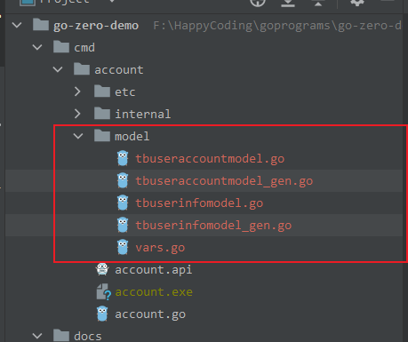

# goctl model自动生成MySQL访问代码
重要命令
* `goctl model mysql datasource -url="root:123456@tcp(127.0.0.1:3306)/chat" -table="*"  -dir="./model"`
* `goctl model mysql ddl -src="./*.sql" -dir="./sql/model" -c`

## 表已创建
### 查看表信息
已知对应MySQL中已经存在数据库和数据库表。数据库路径为：`root:123456@tcp(127.0.0.1:3306)/chat`,先登录看看该数据库中数据表的相关信息。
```sql
sh-4.4# mysql -u root -p chat
mysql: [Warning] World-writable config file '/etc/my.cnf' is ignored.
Enter password:
Reading table information for completion of table and column names
You can turn off this feature to get a quicker startup with -A

Welcome to the MySQL monitor.  Commands end with ; or \g.
Your MySQL connection id is 10
Server version: 8.0.34 MySQL Community Server - GPL

Copyright (c) 2000, 2023, Oracle and/or its affiliates.

Oracle is a registered trademark of Oracle Corporation and/or its
affiliates. Other names may be trademarks of their respective
owners.

Type 'help;' or '\h' for help. Type '\c' to clear the current input statement.

mysql> show tables;
+----------------+
| Tables_in_chat |
+----------------+
| TbUserAccount  |
| TbUserInfo     |
+----------------+
2 rows in set (0.00 sec)
```
根据以上信息可以看到，`chat`库中有两张表。以下输入命令查看每张表的建表信息。

### 查看TbUserAccount表
```sql
mysql> show create table TbUserAccount;
+---------------+--------------------------------------------------------------------------------------------------------------------------------------------------------------------+
| Table         | Create Table                                                                                                                                                       |
+---------------+--------------------------------------------------------------------------------------------------------------------------------------------------------------------+
| TbUserAccount | CREATE TABLE `TbUserAccount` (
`accountName` varchar(191) NOT NULL,
`password` longtext,
PRIMARY KEY (`accountName`)
) ENGINE=InnoDB DEFAULT CHARSET=utf8mb3 |
+---------------+--------------------------------------------------------------------------------------------------------------------------------------------------------------------+
1 row in set (0.01 sec)
```

### 查看TbUserInfo表
```sql
mysql> show create table TbUserInfo;
+------------+-------------------------------------------------------------------------------------------------------------------------------------------------------------------------------------------------------------------------------------------------+
| Table      | Create Table                                                                                                                                                                                                                                    |
+------------+-------------------------------------------------------------------------------------------------------------------------------------------------------------------------------------------------------------------------------------------------+
| TbUserInfo | CREATE TABLE `TbUserInfo` (
`accountName` varchar(191) NOT NULL,
`nickName` longtext,
`birthday` longtext,
`gender` bigint DEFAULT NULL,
`avatarPath` longtext,
PRIMARY KEY (`accountName`)
) ENGINE=InnoDB DEFAULT CHARSET=utf8mb3 |
+------------+-------------------------------------------------------------------------------------------------------------------------------------------------------------------------------------------------------------------------------------------------+
1 row in set (0.00 sec)
```

### 自动生成表相关代码
用以下命令可以自动生成相应的`model`层代码
```
goctl model mysql datasource -url="root:123456@tcp(127.0.0.1:3306)/chat" -table="*"  -dir="./model"
```
> 以上命令在`/cmd/account`目录下执行，生成的`model`目录就在该目录下。最终效果如图所示。



## 表未创建
```
goctl model mysql ddl -src="./*.sql" -dir="./sql/model" -c
```
> 其中`src`指定`sql`脚本的地址，`dir`指定生成的代码的路径

TODO: 补充相应内容

## 参考链接
* 详细代码详见：[luweiqianyi:go-zero-demo](https://github.com/luweiqianyi/go-zero-demo.git)