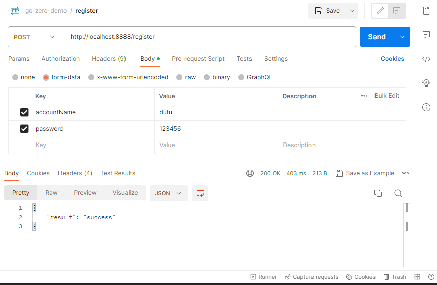
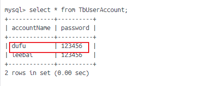

# 使用goctl model自动生成的代码完成业务过程
本文档沿袭`03-goctl-model-usage.md`,使用该文章自动生成的代码完成业务过程`register`。详细步骤如下所示：

1. `account-api.yaml`配置要访问的数据库信息:
    ```yaml
    MySQL:
    DataSource: root:123456@tcp(localhost:3306)/chat?charset=utf8mb4&parseTime=true&loc=Asia%2FShanghai
    ```
2. `cmd/account/internal/config/config.go` 中增加MySQL相关的配置代码
    ```go
    type Config struct {
        rest.RestConf

        MySQL struct {
            DataSource string
        }
    }
    ```
3. `cmd/account/internal/svc/servicecontext.go`增加连接到具体数据表相关代码
    ```go
    func NewServiceContext(c config.Config) *ServiceContext {
        conn := sqlx.NewMysql(c.MySQL.DataSource)

        return &ServiceContext{
            Config:             c,
            TbUserAccountModel: model.NewTbUserAccountModel(conn),// 这里使用了model模块中自动生成的代码
        }
    }
    ```
4. `cmd/account/internal/logic/registerlogic.go`在注册业务逻辑数据代码中处理请求输入，然后查询数据库，返回响应
    ```go
    func (l *RegisterLogic) Register(req *types.RegisterReq) (resp *types.RegisterResp, err error) {
        record := &model.TbUserAccount{
            AccountName: req.AccountName,
            Password: sql.NullString{
                String: req.Password,
                Valid:  true,
            },
        }
        result, err := l.svcCtx.TbUserAccountModel.Insert(l.ctx, record)

        resp = new(types.RegisterResp)
        if err != nil {
            resp.Result = _const.ApiFailed
            resp.Message = fmt.Sprintf("result: %#v, err:%v", result, err)
        } else {
            resp.Result = _const.ApiSuccess
        }
        return
    }
    ```
5. 使用postman构造注册请求
    
6. 登录mysql查看对应记录是否插入到数据库中
    
7. 至此，可以完成了基于`go-zero`完成一次业务与`mysql`交互的逻辑

## 参考链接
* 详细代码详见：[luweiqianyi:go-zero-demo](https://github.com/luweiqianyi/go-zero-demo.git)