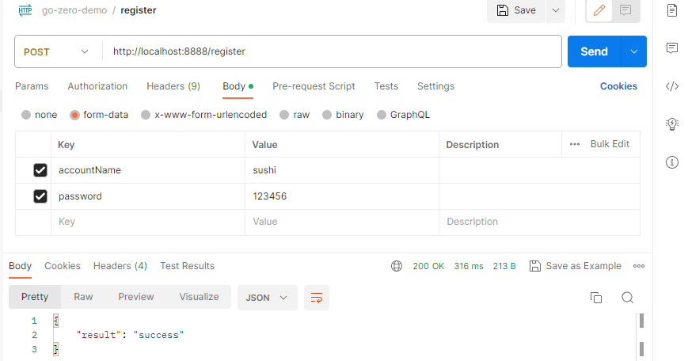

# 注册逻辑优化
本文档主要基于`04-go-model-usage-2.md`提交时修改的代码的基础上对密码项进行加密，然后再存到数据库中。

1. `account-api.yaml`配置加密串
    ```yaml
    Salt: HWVOFkGgPTryzICwd7qnJaZR9KQ2i8xe
    ```
2. `cmd/account/internal/config/config.go` 中增加Salt相关的配置代码
    ```go
    type Config struct {
        rest.RestConf

        MySQL struct {
            DataSource string
        }

        Salt string
    }
    ```
3. 修改`registerlogic.go`中代码，如下所示
    ```go
    func (l *RegisterLogic) Register(req *types.RegisterReq) (resp *types.RegisterResp, err error) {
        encryptedPassword := cryptx.PasswordEncrypt(l.svcCtx.Config.Salt, req.Password)
        record := &model.TbUserAccount{
            AccountName: req.AccountName,
            Password: sql.NullString{
                String: encryptedPassword,
                Valid:  true,
            },
        }
        result, err := l.svcCtx.TbUserAccountModel.Insert(l.ctx, record)

        resp = new(types.RegisterResp)
        if err != nil {
            resp.Result = _const.ApiFailed
            resp.Message = fmt.Sprintf("result: %#v, err: %v", result, err)
        } else {
            resp.Result = _const.ApiSuccess
        }
        return
    }
    ```
4. `postman`发送请求

5. `mysql`验证请求结果
```
mysql> select * from TbUserAccount;
+-------------+------------------------------------------------------------------+
| accountName | password                                                         |
+-------------+------------------------------------------------------------------+
| dufu        | 123456                                                           |
| leebai      | 123456                                                           |
| sushi       | ef8364020560a703cfc7aebebcd0b62d1bfea7d4a841eb8964cfbcda2ba85dd5 |
+-------------+------------------------------------------------------------------+
3 rows in set (0.00 sec)
```
5. 至此，完成注册时密码加密功能

## 参考链接
* 详细代码详见：[luweiqianyi:go-zero-demo](https://github.com/luweiqianyi/go-zero-demo.git)