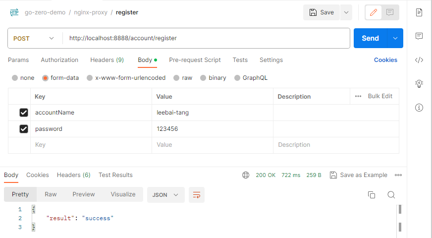

# 对 06-gateway-config-add-nginx-proxy.md的补充
## 简介
本文档是对文档`06-gateway-config-add-nginx-proxy.md`中不足地方的补充。
## 遇到的问题
在`06-gateway-config-add-nginx-proxy.md`这篇文章的容器环境下，我们使用`/register`去访问`account-api`服务，想要达到获取响应的目的。在`account-api`服务的源码实现中，其底层是访问了`mysql`的,详见`https://github.com/luweiqianyi/go-zero-demo.git`的`SHA-1:5a6acd0ff9471f7fe75e3f2a9a6c056c23fa9b02`次提交，为了偷懒，本来想要访问是其他项目通过`docker-compose.yml`部署的`mysql`，但是通过在宿主机上的`postman`中构造请求，访问地址`http://localhost:8002/register`时发生了请求失败的情况，查看容器`account-api`的日志发现
```log
2023-08-17 13:32:18 {"@timestamp":"2023-08-17T05:32:18.556Z","caller":"handler/loghandler.go:132","content":"[HTTP] 503 - POST /register - 172.19.0.1 - PostmanRuntime/7.32.3 - slowcall(3000.4ms)","duration":"3000.4ms","level":"slow","span":"7539e38ca8556939","trace":"8199e5be82391ae56ebd34db19591dc7"}
2023-08-17 13:32:18 {"@timestamp":"2023-08-17T05:32:18.564Z","caller":"handler/loghandler.go:157","content":"[HTTP] 503 - POST /register - 172.19.0.1 - PostmanRuntime/7.32.3\nPOST /register HTTP/1.0\r\nHost: localhost:8888\r\nConnection: close\r\nAccept: */*\r\nAccept-Encoding: gzip, deflate, br\r\nCache-Control: no-cache\r\nConnection: close\r\nContent-Length: 285\r\nContent-Type: multipart/form-data; boundary=--------------------------670576863632746855210173\r\nPostman-Token: 5a49ef5a-b7e4-4b09-9857-990987e91056\r\nRemote-Host: 172.19.0.1\r\nUser-Agent: PostmanRuntime/7.32.3\r\nX-Forwarded-For: 172.19.0.1\r\nX-Real-Ip: 172.19.0.1\r\n\r\n----------------------------670576863632746855210173\r\nContent-Disposition: form-data; name=\"accountName\"\r\n\r\nleebai\r\n----------------------------670576863632746855210173\r\nContent-Disposition: form-data; name=\"password\"\r\n\r\n123456\r\n----------------------------670576863632746855210173--\r\n","duration":"3000.4ms","level":"error","span":"7539e38ca8556939","trace":"8199e5be82391ae56ebd34db19591dc7"}
2023-08-17 13:32:23 {"@timestamp":"2023-08-17T05:32:23.902Z","caller":"sqlx/utils.go:135","content":"Error on getting sql instance of tcp(mysql:3306)/chat?charset=utf8mb4\u0026parseTime=true: dial tcp: lookup mysql on 127.0.0.11:53: server misbehaving","level":"error","span":"882952bfaa301c5c","trace":"8199e5be82391ae56ebd34db19591dc7"}
2023-08-17 13:32:24 {"@timestamp":"2023-08-17T05:32:24.281Z","caller":"stat/metrics.go:210","content":"(account-api) - qps: 0.0/s, drops: 0, avg time: 8275.0ms, med: 8346.5ms, 90th: 8346.5ms, 99th: 8346.5ms, 99.9th: 8346.5ms","level":"stat"}
```
从上面的日志可以看出，请求确实从我的宿主机发送到了`account-api服务`，但是处理失败了，原因是`dial tcp: lookup mysql on 127.0.0.11:53: server misbehaving`,这说明`account-api服务`到`mysql`容器的连接出现了问题，可能访问不了。

这时候，我们用`docker network ls`查看了一下`Docker`环境中的网络环境,如下所示：
```
NETWORK ID     NAME                            DRIVER    SCOPE
6a95da44d38b   bridge                          bridge    local
28cf7f361bc8   chat-services_default           bridge    local
2e29c94a7552   go-zero-demo_default            bridge    local
181c6b738628   go-zero-looklook_looklook_net   bridge    local
357988f29103   host                            host      local
70c776140f1c   none                            null      local
```
以上网络中`chat-services_default`,`go-zero-demo_default`,`go-zero-looklook_looklook_net`是分别是三个项目的`docker-compose.yml`部署的环境。在我的宿主机上，只启动了三个容器，分别是`nginx-latest`服务、`account-api`服务和`mysql`服务。其中`nginx-latest`服务、`account-api`服务是项目`go-zero-demo`跑起来的,`mysql`服务是项目`chat-services`跑起来的。那么这里我的第一猜测是不同的`docker-compose.yml`构建起来的容器环境的网络环境可能会不同，导致二者不能相互访问。以下，分别用命令
```
docker network inspect chat-services_default
```
和命令
```
docker network inspect go-zero-demo_default
```
查看了一下两个环境的网络情况。上述两条命令的执行情况分别如下所示：
```json
[
    {
        "Name": "chat-services_default",
        "Id": "28cf7f361bc82b020c89362c41109a899369edaa8bce1a828d8936f42cd7e8d8",
        "Created": "2023-08-10T11:04:00.0490201Z",
        "Scope": "local",
        "Driver": "bridge",
        "EnableIPv6": false,
        "IPAM": {
            "Driver": "default",
            "Options": null,
            "Config": [
                {
                    "Subnet": "172.18.0.0/16",
                    "Gateway": "172.18.0.1"
                }
            ]
        },
        "Internal": false,
        "Attachable": false,
        "Ingress": false,
        "ConfigFrom": {
            "Network": ""
        },
        "ConfigOnly": false,
        "Containers": {
            "643b36495c6c785fb990440896fb2c31c41f73179eaf14ead4c3bce124eea355": {
                "Name": "mysql",
                "EndpointID": "d4a6704463071867a8e0dca82c67142402917d63c10e119820561e9d67c8e192",
                "MacAddress": "02:42:ac:12:00:02",
                "IPv4Address": "172.18.0.2/16",
                "IPv6Address": ""
            }
        },
        "Options": {},
        "Labels": {
            "com.docker.compose.network": "default",
            "com.docker.compose.project": "chat-services",
            "com.docker.compose.version": "2.20.2"
        }
    }
]
```
和
```json
[
    {
        "Name": "go-zero-demo_default",
        "Id": "2e29c94a755215730522a844138b41a0aaa87722e84f320c4a853a8928d5e5fb",
        "Created": "2023-08-16T08:52:59.1434515Z",
        "Scope": "local",
        "Driver": "bridge",
        "EnableIPv6": false,
        "IPAM": {
            "Driver": "default",
            "Options": null,
            "Config": [
                {
                    "Subnet": "172.19.0.0/16",
                    "Gateway": "172.19.0.1"
                }
            ]
        },
        "Internal": false,
        "Attachable": false,
        "Ingress": false,
        "ConfigFrom": {
            "Network": ""
        },
        "ConfigOnly": false,
        "Containers": {
            "3f432f02c50f182057c12798329b8201393f0be66f1868df61aabc2c039ba91c": {
                "Name": "account-api",
                "EndpointID": "35e9ef7654bf7412cd7d165f87cb1f85af760875b8c1afc204b4ffc6629508b0",
                "MacAddress": "02:42:ac:13:00:02",
                "IPv4Address": "172.19.0.2/16",
                "IPv6Address": ""
            },
            "b5099b61401d9148bc1593a97eb3e7565df1f076ab5bdc9fb9081f815cb7c7db": {
                "Name": "nginx-latest",
                "EndpointID": "65198d3699d1fe876914d6df6f297cb80d722055334cb20e4a79567496de6737",
                "MacAddress": "02:42:ac:13:00:03",
                "IPv4Address": "172.19.0.3/16",
                "IPv6Address": ""
            }
        },
        "Options": {},
        "Labels": {
            "com.docker.compose.network": "default",
            "com.docker.compose.project": "go-zero-demo",
            "com.docker.compose.version": "2.20.2"
        }
    }
]
```
从上面可以看到三个容器的网络环境为：
* `account-api`服务与`nginx-latest`服务处于同一子网下，网关是`172.19.0.1`，子网是`172.19.0.0/16`
* `mysql`服务和上述两个服务不在同一子网,它所处网关是`172.18.0.1`,子网是`172.18.0.0/16`

`account-api`服务与`mysql`服务处于不同子网中，不加另外配置二者是不能相互通信的。具体解决方案详看下一章节
 ## 解决方案
 这里只需要修改本项目的`docker-compsoe.yml`配置即可，让`account-api`能够访问`mysql`服务即可。
 以下贴出修改后的`docker-compsoe.yml`文件内容：
 ```yml
 version: '3'
services:
  nginx:
    image: nginx:latest
    container_name: nginx-latest
    ports:
      - "8888:8081" #访问主机端口8888,映射到容器端口8081,nginx在Docker内的端口为8081
    volumes:
      - ./nginx/nginx.conf:/etc/nginx/nginx.conf
      - ./nginx/log:/var/log/nginx

  account:
    image: account:1.0.0
    container_name: account-api
    ports:
      - "8002:8002"
    volumes:
      - ./account/etc/account-api.yaml:/usr/local/bin/account/etc/account-api.yaml
    networks:
      - default
      - external_network


networks:
  external_network:
    external:
      name: chat-services_default
 ```
 * 以上配置中，增加以个名叫`external_network`的配置，它使用`extren`关键字使其能够访问一个网络名叫做`chat-services_default`的网络，然后在`account-api`容器下使用关键字`networks`配置使得该容器能够访问`chat-services_default`网络。
 * 然后，运行`docker-compose -p go-zero-demo up -d`重新部署环境即可。
 > 注意：account容器的配置中`- default`不能缺少，否则，该容器无法与本子网的其他容器进行通信。

 ## 验证解决方案
 * 还是用`postman`构造`/register`请求，访问地址:`http://localhost:8888/account/register`,结果如下
 

 ## 参考链接
* 详细代码详见：[luweiqianyi:go-zero-demo](https://github.com/luweiqianyi/go-zero-demo.git)