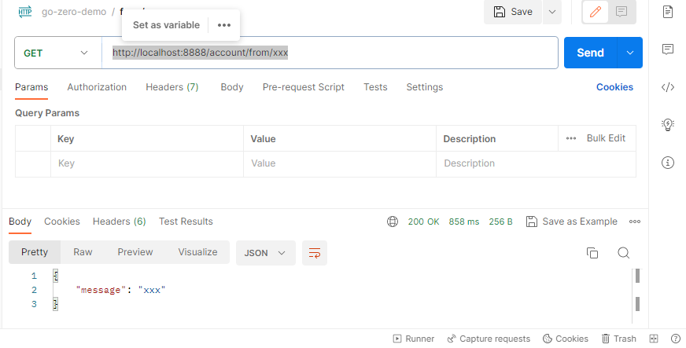

# 统一网关
给该项目下的微服务设置一个统一网关，由该网关完成统一鉴权，或者同一功能处理。
这里暂时使用`nginx`做统一网关处理。详细步骤见如下章节。
## docker中部署nginx
### docker compose方式部署
本项目不提供`docker run`的方式来下载，构建容器的方式。很笨。
1. `docker-env`目录下新增`docker-compose.yml`文件，内容如下
    ```yml
    version: '3'
    services:
    nginx:
        image: nginx:latest
        container_name: nginx-latest
        ports:
        - "8888:8081" #访问主机端口8888,映射到容器端口8081,nginx在Docker内的端口为8081
        volumes:
        - ./nginx/nginx.conf:/etc/nginx/nginx.conf
        - ./nginx/log:/var/log/nginx

    account:
        image: account:1.0.0
        container_name: account-api
        ports:
        - "8002:8002"
        volumes:
        - ./account/etc/account-api.yaml:/usr/local/bin/account/etc/account-api.yaml
    ```
    * 以上配置`nginx`的容器端口为`8081`，宿主机端口为`8888`,这样在宿主机中访问端口`8888`时会被映射到容器的`8881`端口
2. 以上`docker-compose.yml`文件中`nginx.conf`配置文件内容如下，暂时先忽略以`#`开始的注释配置
    ```yml

    user  nginx;
    worker_processes  auto;

    error_log  /var/log/nginx/error.log notice;
    pid        /var/run/nginx.pid;


    events {
        worker_connections  1024;
    }


    http {
        include       /etc/nginx/mime.types;
        default_type  application/octet-stream;

        log_format  main  '$remote_addr - $remote_user [$time_local] "$request" '
                        '$status $body_bytes_sent "$http_referer" '
                        '"$http_user_agent" "$http_x_forwarded_for"';

        access_log  /var/log/nginx/access.log  main;

        sendfile        on;
        #tcp_nopush     on;

        keepalive_timeout  65;

        #gzip  on;
        server {
            listen 8081;
            access_log /var/log/nginx/go-zero-demo_access.log;
            error_log /var/log/nginx/go-zero-demo_error.log;

    #         location /auth {
    #             # 将该 location 声明为内部请求，只能由其他 Nginx 配置内部的请求访问，外部请求无法直接访问该 location
    #             internal;
    #             # 将原始请求的 URI 存储在请求头的 "X-Original-URI" 字段中
    #             proxy_set_header X-Original-URI $request_uri;
    #             # 禁止向后端服务器传递请求体
    #             proxy_pass_request_body off;
    #             # 将代理请求的 "Content-Length" 请求头设置为空字符，以防止向后端服务器传递错误的请求长度
    #             proxy_set_header Content-Length "";
    #             # 将请求转发到位于 "http://identity-api:8001/identity/v1/verify/token" 的后端服务器
    #             proxy_pass http://identity-api:8001/identity/v1/verify/token;
    #         }

            location /account/ {
                # 向"/auth" 路径发送一个子请求进行身份验证
                # auth_request /auth;
                # 将上游响应头中的 "X-User" 字段的值赋给变量"user",在通过身份验证后，上游服务器会在响应头中包含用户信息，该指令将该信息存储在"user"变量中
                auth_request_set $user $upstream_http_x_user;
                # 将 "$user" 变量的值设置为请求头的 "x-user" 字段，将用户信息传递到后端服务器
                proxy_set_header x-user $user;
                # 将请求头中的 "Host" 字段值传递到后端服务器，用于正确处理反向代理和虚拟主机的情况
                proxy_set_header Host $http_host;
                # 将客户端的真实 IP 地址传递到后端服务器的请求头中
                proxy_set_header X-Real-IP $remote_addr;
                # 将客户端的 IP 地址传递到后端服务器的请求头中的"REMOTE-HOST"字段
                proxy_set_header REMOTE-HOST $remote_addr;
                # 将客户端的 IP 地址添加到 "X-Forwarded-For" 请求头中，用于标识原始客户端的 IP 地址
                proxy_set_header X-Forwarded-For $proxy_add_x_forwarded_for;
                # 若访问地址为“http://localhost:8888/account/login”，则会被重定向到“http://account-api:8002/login”
                rewrite ^/account/(.*) /$1 break;
                # 将请求转发到位于 "http://usercenter-api:8002" 的后端服务器
                proxy_pass http://account-api:8002;
            }
        }

        include /etc/nginx/conf.d/*.conf;
    }
    ```
    * 从配置文件可以看出，当`nginx`的`8081/account/*`有请求时，会被转发到`http://account-api:8002/*`进行处理，`*`可以取`login`,`register`等等，可以在`account服务`的源码来提供对应`path`的处理逻辑，其中`account-api`正是`account服务`在`docker-compose.yml`中配置的容器名称。因为在`Dokcer`中,容器名可以用来唯一标识容器，即我们的`account服务`。
    * 另外，`account-api.yml`的配置如下所示
        ```yml
        Name: account-api
        Host: 0.0.0.0
        Port: 8002

        MySQL:
        DataSource: root:123456@tcp(mysql:3306)/chat?charset=utf8mb4&parseTime=true

        Salt: HWVOFkGgPTryzICwd7qnJaZR9KQ2i8xe

        ```
3. 部署
    ```shell
    docker-compose -p go-zero-demo up -d
    ```
4. 部署完成后，`nginx-latest`容器和`account-api`容器会成功启动
5. 测试验证,这里使用`postman`进行测试,以接口`/from/xxx`进行测试,注意：由于这里使用配置使用`nginx`作为代理服务，而不是直接访问`account服务`，所以需要使用的测试访问地址为: `http://localhost:8888/account/from/xxx`,具体测试结果如下图所示：
    
6. 通过以上可知，`nginx.conf`关于`account-api`的配置确实生效了。

## 参考链接
* 详细代码详见：[luweiqianyi:go-zero-demo](https://github.com/luweiqianyi/go-zero-demo.git)