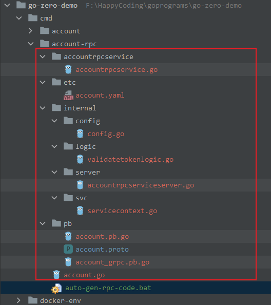
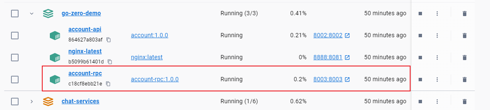

# goctl rpc教程
## 前景
以`account`服务为例，创建相应的rpc服务，由于在此实践之前`account`目录结构已经定下来了,现在再调整改动比较大，与此同时相应的文档和脚本文件可能都要修改，所以这里不再修改了原目录结构了。

因此在`cmd`目录下重新建了一个叫做`account-rpc`的目录。该目录中只提供`rpc`服务，不提供`api`服务。在`account-rpc`目录下新建`pb`目录，用来放置该服务涉及的`*.proto`文件。

## 具体过程
1. 新建一个`account.proto`文件，在该文件内部定义一些`rpc`接口，这里提供一个简单的接口定义文件
```proto
syntax = "proto3";

option go_package = "./pb";

package pb;

message TokenValidateReq{
  string accountName=1;
  string token = 2;
}

message TokenValidateResp{
  bool ok=1;
}

service AccountRpcService{
  rpc ValidateToken(TokenValidateReq) returns(TokenValidateResp);
}
```
2. 返回`account-rpc`目录，新建`bat`脚本文件：`auto-gen-rpc-code.bat`，内容如下:
    ```
    goctl rpc protoc ./pb/account.proto --go_out=. --go-grpc_out=. --zrpc_out=.
    ```
3. 终端进入`cmd/account-rpc`目录，运行`auto-gen-rpc-code.bat`脚本即可
4. 运行成功会自动生成rpc相关的代码及资源文件，如图所示
    
    框中除`account.proto`文件外，皆是由上面的命令执行生成的
5. 这里我们修改一下`account-rpc/internal/logic`目录下的`validatetokenlogic.go`文件中的`ValidateToken`方法,给其返回响应一个`true`，表示无论怎样对该方法发起`rpc`都会成功。至此，源码部分修正完成
6. 接下来，和之前处理`http`请求`account`服务一样，我们将`account-rpc`也通过`Dockerfile`将其制成一个镜像，然后让其在`Docker`中运行。
    * 取名`account-rpc.Dockerfile`,内容如下
        ```Dockerfile
        FROM golang:1.19.2 AS builder

        MAINTAINER runningriven@gmail.com

        WORKDIR /usr/src/go-zero-demo

        COPY . .

        ENV GOPROXY=https://goproxy.cn,direct

        RUN go mod tidy

        RUN CGO_ENABLED=0 GOOS=linux go build -v -o account-rpc ./cmd/account-rpc \
            && cp account-rpc ./cmd/account-rpc/account-rpc

        FROM ubuntu
        WORKDIR /usr/local/bin/account-rpc

        RUN mkdir ./etc

        COPY --from=builder /usr/src/go-zero-demo/cmd/account-rpc/account-rpc ./account-rpc
        COPY --from=builder /usr/src/go-zero-demo/cmd/account-rpc/etc/account.yaml ./etc/account.yaml

        CMD ["./account-rpc"]
        ```
    * 镜像构建完成在`docker-compose.yml`中配置，如下所示：
        ```yml
        account-rpc:
            image: account-rpc:1.0.0
            container_name: account-rpc
            ports:
            - "8003:8003"
            volumes:
            - ./account-rpc/etc/account.yaml:/usr/local/bin/account-rpc/etc/account.yaml

        ```
    * 完成后运行`bat`脚本`run-docker-compose.bat`，构建环境，完成后通过`Docker Desktop`可以看到容器的运行状态如下所示:
    
7. 编写测试程序，上面的`account-rpc`是我们的服务端程序，且部署在`Docker`环境下，在宿主机上访问该容器的话需要另外编写客户端程序，来对`account-rpc`服务进行访问。参照`cmd/account-rpc/test/account-rpc-client_test.go`,具体代码如下:
```go
package test

import (
	"context"
	"fmt"
	"github.com/zeromicro/go-zero/zrpc"
	"go-zero-demo/cmd/account-rpc/accountrpcservice"
	"go-zero-demo/cmd/account-rpc/pb"
	"testing"
)

func TestRpcClient(t *testing.T) {
	// 在docker-compose.yml中将宿主机的8003映射到容器的8003端口,所以，在宿主机上使用地址
	// 127.0.0.1:8003是可以访问我们Docker中启动的account-rpc容器的
	c := zrpc.RpcClientConf{
		Target: "127.0.0.1:8003",
	}
	client := accountrpcservice.NewAccountRpcService(zrpc.MustNewClient(c))
	resp, err := client.ValidateToken(context.Background(), &pb.TokenValidateReq{})
	fmt.Printf("resp: %#v, err: %v\n", resp, err)
}
```
8. 查看运行结果:
    ```log
    === RUN   TestRpcClient
    {"@timestamp":"2023-08-18T14:50:20.660+08:00","caller":"p2c/p2c.go:181","content":"p2c - conn: 127.0.0.1:8003, load: 25311, reqs: 1","level":"stat"}
    resp: &pb.TokenValidateResp{state:impl.MessageState{NoUnkeyedLiterals:pragma.NoUnkeyedLiterals{}, DoNotCompare:pragma.DoNotCompare{}, DoNotCopy:pragma.DoNotCopy{}, atomicMessageInfo:(*impl.MessageInfo)(0xc0002d4148)}, sizeCache:0, unknownFields:[]uint8(nil), Ok:true}, err: <nil>
    --- PASS: TestRpcClient (0.89s)
    PASS

    Process finished with the exit code 0
    ```
    * 由上面的输出结果可以看到，确实有`Ok:true`，说明我们第`5`步是生效的。到此为此，说明我们的`account-rpc`是能够正常提供服务了。接下来只需要完善具体的`token`验证的实现逻辑即可，放在后续的文章中进行阐述。

## 参考链接
* 详细代码详见：[luweiqianyi:go-zero-demo](https://github.com/luweiqianyi/go-zero-demo.git)
