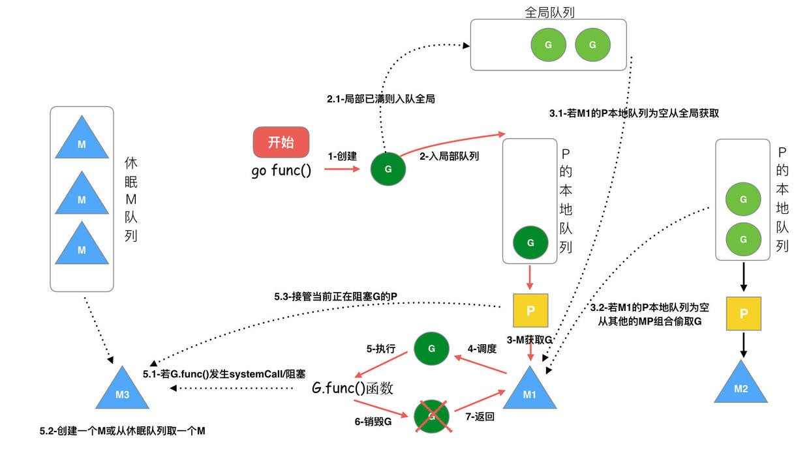

# golang GMP模型
* G: goroutine(协程)
* P: processor(调度单元/调度器)
* M: kernel thread(内核协程)

## 协程(G)与线程(M)的绑定模型
### N:1
一个进程的所有协程绑定在一个线程上。

缺点：
* 一旦某个协程阻塞，导致本进程的其他协程无法被调度执行，失去并发能力。
* 失去硬件的多核加速能力。
### 1:1
一个协程绑定一个线程。
优点：
* 不需要设计协程调度算法，协程调度行为完全由内核的调度算法接管。那么这样，根本不需要设计协程，用线程就行了。

缺点：
* 在用户态不具备调度能力，用户态进程无法感知控制内核态的线程调度算法。

### M:N
M个协程绑定到N个线程上。

优点：
* 相较于N:1模型,可以利用了硬件的加速能力，同时避免了因单个协程阻塞导致整个进程阻塞的问题。
* 相较于1:1模型，在用户态具备了控制协程调度的能力。

## 技术选型
根据以上分析，很明确：golang的runtime实现就选择M:N这种协程与内核线程的绑定模型，是我我也选这种啊。

## 协程调度
既然选择了M:N这种协程线程模型，那么runtime的设计者必须设计一种算法来完成协程到内核线程的映射，进而完成协程调度。
### 老版本调度算法
用一个全局队列用来存放go协程，内核线程得空了，想要运行协程时就从全局队列中去取，失去了CPU时间片，就将协程放回全局队列。那么这样必然会有一个缺陷，就是一般来说内核线程是有多个的，如果只有一个全局队列的话就会涉及到竞态问题。为了避免竞态，访问全局队列时必须使用互斥机制(比如加锁、解锁)来避免竞态，这样就造成了性能上的缺陷，想想看这样一种场景：4个内核线程去取全局队列中的10000个协程，每次取和放回都要加锁和解锁-_-||。

### 新版本调度算法
引入一个叫做`Processor`的执行单元，也就是我们开篇说到的`GMP`模型中的`P`。该执行单元的作用就是将协程如何合理地分配到我们的内核线程。所以协程调度算法就可以在该单元里实现。下面详细介绍一下。

* 内核线程不直接和协程发生关系，而是通过与`P`来完成协程的取和放。
* 保持老版本设计，还是保留一个协程的全局队列，存放等待运行的协程。
* 每一个`P`自己有一个协程队列，存放等待运行的协程，这里暂时把该队列叫做`P`的`本地协程队列`，后面使用这个说法。
* 当进程新建一个协程时，该协程首先会被加到某一个`P`的`本地协程队列`，而不是加到`全局队列`。
* 只有当`P`的`本地协程队列`满了，才会将`本地协程队列`中的一半协程移动到`全局队列`。
* 以上只介绍了协程的存，接下来介绍协程的取。
* 上面说了内核线程不直接和协程发生关系，而是通过与`P`来完成协程的取和放。所以，内核线程想要运行一个协程，就会从和它绑定的`P`的`本地协程队列`中取一个协程来调度运行。
* 想像这么一种场景，如果一直没有新建协程，而内核线程一直从`P`的`本地协程队列`中取协程，那么最终`P`的`本地协程队列`会被取空，此时，若系统的`全局队列`中有协程正在等待执行，则该`P`会尝试从`全局队列`中取一批放到自己的`本地协程队列`，然后让与`P`绑定的内核线程去取来执行。或者从别的`P`的`本地协程队列`中取一半放到自己的`本地协程队列`中(这个行为被设计者叫做steal)，让与`P`绑定的内核线程去取来执行。
* 通过这样的设计，相比于老版本的调度算法。取协程的竞争就弱化为: 1. 各个`P`与`全局队列`的竞争 2. 内核线程只从自己绑定的`P`中取, 没有竞争



## 可视化协程信息
1. 利用`runtime/trace`来完成进程信息的记录。
    ```go
        f, err := os.Create("trace.out")
        if err != nil {
            panic(err)
        }
        defer f.Close()

        err = trace.Start(f)
        if err != nil {
            panic(err)
        }
        defer trace.Stop()
    ```
    > 将上述代码放入程序源代码中，完成信息采集。
2. 执行`go tool trace trace.out`，查看协程运行时信息即可。

至于GMP,我个人认为理解到这里已经够了,更多内容可详见参考链接。
## 参考链接
* [Golang 调度器 GMP 原理与调度全分析](https://learnku.com/articles/41728)