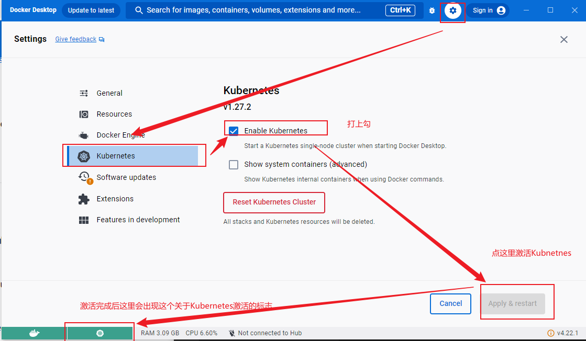

# Pod
## 什么是pod
* `Kubernetes`中最小的可部署和可管理的计算单元。
* 一个`Pod`可以管理一个或者多个容器。
* 一个`Pod`中的容器共享存储资源、网络资源。
* 一个`Pod`的共享`context`指的是`Linux`的`namespace`,`cgroups`,和其他隔离特性的集合。
* 在`Kubernetes`内运行的`Pod`运行在一个私有的、隔离的网络上。
## 把容器打包到一个pod中去
1. `Docker Desktop`激活`Kubernetes`

2. 编写`pod`的配置文件,比如`pod.yaml`
```yaml
apiVersion: v1
kind: Pod
metadata:
  name: nginx
spec:
  containers:
  - name: nginx
    image: nginx:1.24.0
    ports:
    - containerPort: 80
```
* `apiVersion: v1`：指定了使用的`Kubernetes API`版本。
* `kind: Pod`：指定了资源类型为`Pod`
* `metadata`：定义了`Pod`的元数据，包括名称(`name`)
* `spec`：定义了`Pod`的规格，包括它包含的容器(`containers`)
* `containers`：定义了`Pod`中的容器列表
* `- name: nginx`：定义了容器的名称
* `image: nginx:1.24.0`：指定了容器所使用的镜像，这里使用的是`nginx:1.24.0`
* `ports`：定义了容器要暴露的端口列表
* `- containerPort: 80`：指定了容器内部监听的端口，这里是`80`
3. 创建`pod`
```shell
kubectl apply -f pod.yaml
```
4. 查看`pod`状态
```shell
kubectl get pods
```
5. 删除`pod`
```yaml
kubectl delete -f pod.yaml
```
### 测试
相同的过程，我们下面定义一个`service1`的服务。`service1`服务的程序源码和`Docker`镜像制作文件详见: [service1服务源码](https://github.com/luweiqianyi/go/tree/master/metrics/cmd/service1)
```yaml
apiVersion: v1
kind: Pod
metadata:
  name: service1
spec:
  containers:
  - name: service1
    image: service1:1.0.0
    ports:
    - containerPort: 8001
```

类似于上面第3步的过程，此时我们已在`Pod`运行起来了一个服务`service1`。该服务提供了一个`/hello`的`URL`路径用于访问，请求方式为`http get`。
> 如果yaml的文件名是`pod-service1.yaml`，则执行的命令就是`kubectl apply -f pod-service1.yaml`

当我在主机的浏览器地址栏输入`http://localhost:8001`, 浏览器提示禁止访问。原因是: `Pod`的网络环境和宿主机的网络环境是不通的。

那么如何使得可以访问？输入以下命令即可
```shell
kubectl port-forward service1 8001:8001
```
> 以上命令是将pod中的服务`service1`的`8001`端口转发到宿主机的`8001`端口上

上面命令的运行结果如下：
```shell
PS E:\Kubernetes\pods> kubectl port-forward service1 8001:8001
Forwarding from 127.0.0.1:8001 -> 8001
Forwarding from [::1]:8001 -> 8001
Handling connection for 8001
Handling connection for 8001
Handling connection for 8001
```

然后再用上面的地址去访问，就得到了响应：`{"message":"Hello, I am service1!"}`。

另外一种查看请求是否成功到达`pod`: 通过命令`kubectl logs service1`查看`Pod`中服务的日志即可，如下所示：
```shell
C:\Users\Nicklaus>kubectl logs service1
[GIN-debug] [WARNING] Creating an Engine instance with the Logger and Recovery middleware already attached.

[GIN-debug] [WARNING] Running in "debug" mode. Switch to "release" mode in production.
 - using env:   export GIN_MODE=release
 - using code:  gin.SetMode(gin.ReleaseMode)

[GIN-debug] GET    /hello                    --> main.main.func1 (3 handlers)
[GIN-debug] GET    /metrics                  --> github.com/gin-gonic/gin.WrapH.func1 (3 handlers)
[GIN-debug] [WARNING] You trusted all proxies, this is NOT safe. We recommend you to set a value.
Please check https://pkg.go.dev/github.com/gin-gonic/gin#readme-don-t-trust-all-proxies for details.
[GIN-debug] Listening and serving HTTP on :8001
[GIN] 2023/09/20 - 09:11:51 | 200 |        40.2µs |       127.0.0.1 | GET      "/hello"
[GIN] 2023/09/20 - 09:11:51 | 404 |         500ns |       127.0.0.1 | GET      "/favicon.ico"
[GIN] 2023/09/20 - 09:16:57 | 200 |        32.5µs |       127.0.0.1 | GET      "/hello"
[GIN] 2023/09/20 - 09:34:44 | 200 |        71.5µs |       127.0.0.1 | GET      "/hello"
[GIN] 2023/09/20 - 09:34:44 | 404 |         400ns |       127.0.0.1 | GET      "/favicon.ico"
```

至此，就完成了一个将服务部署到`Kubernetes`中，并通过外部主机访问该服务的整个流程。

最终，测试完成后记得执行命令`kubectl delete -f pod-service1.yaml`把节点删除掉，不然一直在服务器上运行。