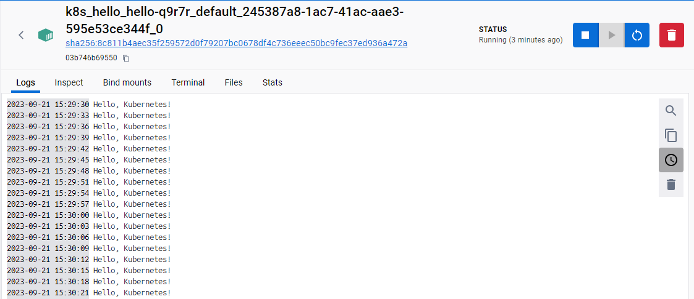

# kubernetes-job
## 什么是job
在`Kubernetes`中，`Pod`是最小的可调度单元，用于运行容器。而`Job`是一种控制器对象，它用来创建和管理一批`Pod`，以便完成特定任务。

虽然可以直接创建`Pod`来运行容器，并且让其周期性地执行任务，但是当任务完成后，`Pod`仍会持续保持运行状态。这可能会导致资源浪费和管理上的困难。

`Job`提供了更高级别的抽象，它负责创建`Pod`并确保任务的完成。当任务完成后，`Job`将自动清理相关的`Pod`资源，从而避免了资源浪费和手动管理的麻烦。此外，`Job`还具有重试和并行处理等功能，用于确保任务的正确执行。

因此，当你想要周期性地执行任务或仅需运行一次的任务时，使用`Job`比直接创建`Pod`更为合适。`Job`提供了更强大的控制和管理能力，帮助你有效地管理任务的生命周期，并确保任务的完成和正确性。

## job配置
```yaml
apiVersion: batch/v1
kind: Job
metadata:
  name: hello #job name
spec:
  template: #PodTemplate
    # This is the pod template
    spec:
      containers:
      - name: hello
        image: busybox:1.28
        command: ['sh', '-c', "while true; do echo 'Hello, Kubernetes!'; sleep 3; done"]
      restartPolicy: OnFailure
    # The pod template ends here
```
> 以上配置创建一个每隔3s，周期性打印`Hello, Kubernetes!`的job
## job启动
```shell
kubectl apply -f job-hello.yaml
```
结果：
```log
job.batch/hello created
```



## 查看job
```shell
PS E:\Kubernetes\jobs> kubectl get jobs
NAME    COMPLETIONS   DURATION   AGE
hello   0/1           6m18s      6m18s
```

## 删除job
```shell
PS E:\Kubernetes\jobs> kubectl delete -f job-hello.yaml
job.batch "hello" deleted
```