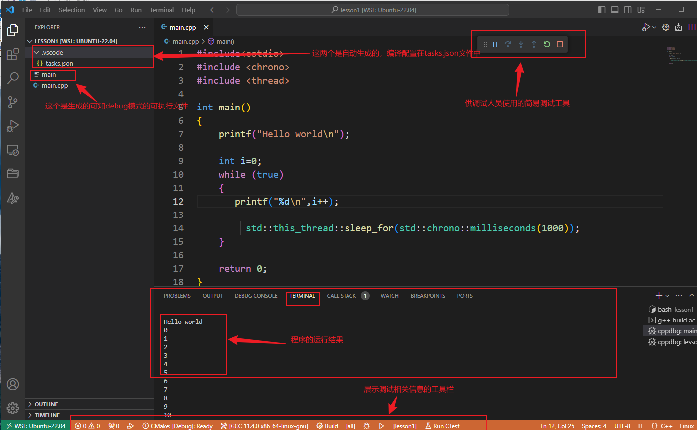

# vscode gdb本地调试
## 背景介绍
本文主要介绍使用`visual studio code`如何调试`linux c++`程序。使用的环境是`wsl`下的`ubuntu`分发。

主要介绍了`gdb debug`和`gdb attach`两种方式来进行本地调试。

## visual studio code使用gdb debug实战
### 项目结构
```shell
.
└── main.cpp
```
### 程序文件
```cpp
#include<cstdio>
#include <chrono>
#include <thread>

int main()
{
    printf("Hello world\n");

    int i=0;
    while (true)
    {
       printf("%d\n",i++);

         std::this_thread::sleep_for(std::chrono::milliseconds(1000));
    }
    
    return 0;
}
```
### 以debug的方式执行程序
1. 选择`debug`的编译工具



2. 这里我们需要对`tasks.json`做一点修改，以满足我们自己的需求(主要是设置生成的可执行文件名设置为`lesson1`,可执行文件放到`bin`目录下)
3. 修改后的`tasks.json`文件如下所示
    ```json
    {
        "tasks": [
            {
                "type": "cppbuild",
                "label": "C/C++: g++ build active file",
                "command": "/usr/bin/g++",
                "args": [
                    "-fdiagnostics-color=always",
                    "-g",
                    "${file}",
                    "-o",
                    "${workspaceFolder}/bin/lesson1"
                ],
                "options": {
                    "cwd": "${workspaceFolder}"
                },
                "problemMatcher": [
                    "$gcc"
                ],
                "group": {
                    "kind": "build",
                    "isDefault": true
                },
                "detail": "Task generated by Debugger."
            }
        ],
        "version": "2.0.0"
    }
    ```
    以下对上面的配置做详细解释
    * 在`args`中修改可执行文件的生成目录和文件名；在`cwd`设置工作目录
    * 以上设置最终转化成的命令为`/usr/bin/g++ -fdiagnostics-color=always -g /root/code/cmake-tutorial/lesson1/main.cpp -o /root/code/cmake-tutorial/lesson1/bin/lesson1`
    * `-fdiagnostics-color=always`：表示启用颜色输出，以便更直观地显示编译器的错误和警告信息
    * `-g`：表示在编译过程中生成调试信息，以方便调试代码
    * 后面的就是源码路径和生成的可执行文件路径以及可执行文件名

4. 经过上面修改，重新`debug`生成的目录结构如下所示，程序也能正常以`debug`的方式运行起来。


### gdb debug总结
* 以上可执行文件的生成方式完全取决于`tasks.json`的配置，对于某些项目来说，可能是使用`cmake`来进行构建的，这种配置可能不适用于该类型项目的调试，除非将`tasks.json`的配置调的完全和`cmake`的配置一模一样(这恐怕难度有点大)。
* 以上方式，局限于程序源代码和生成的可执行文件在同一台主机上，并不适用于程序源码在主机1上，而可执行文件在主机2上的这种场景。

## visual studio code使用gdb attach实战
本章节主要介绍了源码程序使用`cmake`来进行构建，生成相应的可执行文件，运行可执行文件，然后使用`visual studio code`的`gdb attach`来调试已经运行的可执行文件的过程。主要介绍了项目结构、程序文件、项目构建、以及如何使用`gdb attach`。
### 项目结构
```shell
.
├── CMakeLists.txt
├── build.sh
└── main.cpp
```
### 程序文件
#### CMakeLists.txt
```cmake
cmake_minimum_required(VERSION 3.10)
project(lesson1)

# 设置可执行文件的输出目录
set(EXECUTABLE_OUTPUT_PATH ${CMAKE_SOURCE_DIR}/bin)

add_executable(lesson1 main.cpp)
```
#### main.cpp
```cpp
#include<cstdio>
#include <chrono>
#include <thread>

int main()
{
    printf("Hello world\n");

    int i=0;
    while (true)
    {
       printf("%d\n",i++);

         std::this_thread::sleep_for(std::chrono::milliseconds(1000));
    }
    
    return 0;
}
```
#### 构建文件：build.sh
```shell
/usr/bin/cmake --no-warn-unused-cli -DCMAKE_BUILD_TYPE:STRING=Debug -DCMAKE_EXPORT_COMPILE_COMMANDS:BOOL=TRUE -DCMAKE_C_COMPILER:FILEPATH=/usr/bin/gcc -DCMAKE_CXX_COMPILER:FILEPATH=/usr/bin/g++ -S/root/code/cmake-tutorial/lesson1 -B/root/code/cmake-tutorial/lesson1/build -G "Unix Makefiles"

/usr/bin/cmake --build /root/code/cmake-tutorial/lesson1/build --config Debug --target all -j 4 --

# su root ./build.sh # 命令行执行该命令来构建
```
### 项目构建
执行以下命令生成可执行文件即可：
```shell
su root ./build.sh
```
> 构建完成后可以删除`build`目录，这个是存放编译生成的中间文件的目录，并不影响程序的执行。可以使用命令`rm -r build`删除即可。

> 或者在项目构建阶段执行`su root ./build.sh && rm -r build`也可

以上步骤都执行完成后，项目结构如下所示：
```shell
.
├── CMakeLists.txt
├── bin
│   └── lesson1
├── build.sh
└── main.cpp
```

### 使用gdb attach调试
1. 为项目增加配置

> 上述操作完成后会自动在`.vscode`目录下生成`launch.json`文件
2. 初始`launch.json`文件
    ```json
    {
        // Use IntelliSense to learn about possible attributes.
        // Hover to view descriptions of existing attributes.
        // For more information, visit: https://go.microsoft.com/fwlink/?linkid=830387
        "version": "0.2.0",
        "configurations": []
    }
    ```
3. 增加`gdb attach`配置


4. 对自动生成的配置简单修改一下，修改后的内容如下所示
    ```json
    {
        // Use IntelliSense to learn about possible attributes.
        // Hover to view descriptions of existing attributes.
        // For more information, visit: https://go.microsoft.com/fwlink/?linkid=830387
        "version": "0.2.0",
        "configurations": [
            {
                "name": "(gdb) Attach",
                "type": "cppdbg",
                "request": "attach",
                "program": "${workspaceFolder}/bin/lesson1",
                "MIMode": "gdb",
                "setupCommands": [
                    {
                        "description": "Enable pretty-printing for gdb",
                        "text": "-enable-pretty-printing",
                        "ignoreFailures": true
                    },
                    {
                        "description": "Set Disassembly Flavor to Intel",
                        "text": "-gdb-set disassembly-flavor intel",
                        "ignoreFailures": true
                    }
                ]
            }
        ]
    }
    ```
    > "program": "${workspaceFolder}/bin/lesson1",指定生成的可执行文件的全路径即可。
5. 运行可执行文件
    ```shell
    ./bin/lesson1
    ```

6. `attach`到启动的可执行文件，即`lesson1`进程
本操作只需要按一下快捷键`F5`，然后按照下面图示进行操作即可


## 代码地址
源码地址：[cmake-tutorial: lesson2](https://github.com/luweiqianyi/cmake-tutorial/tree/346895c9e9af0673a9e7e18e349c636019bd5ecc/lesson2)