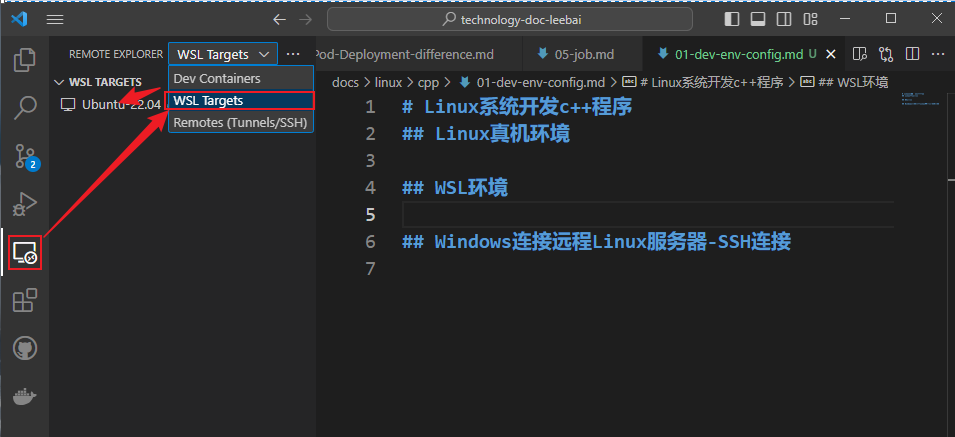
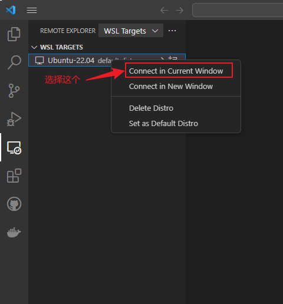
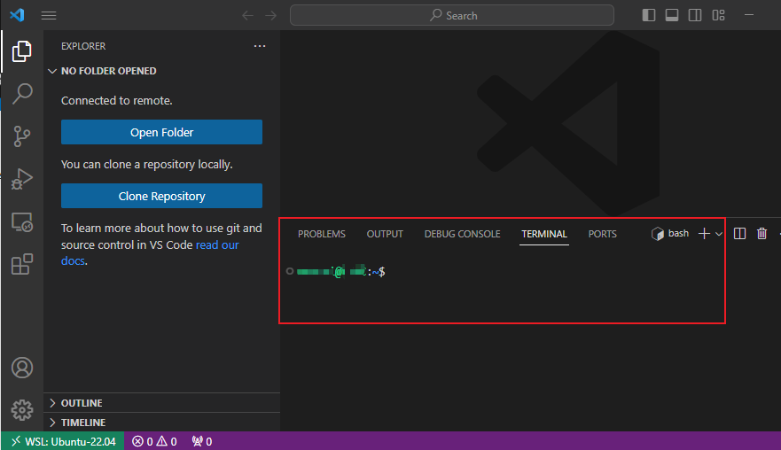
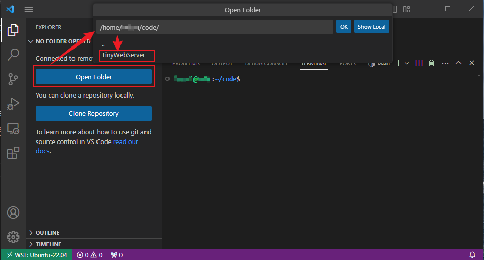
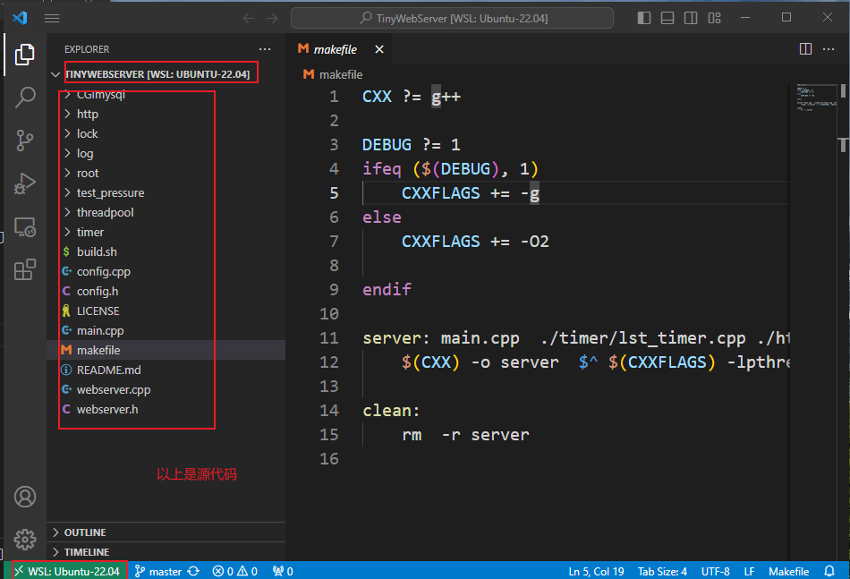
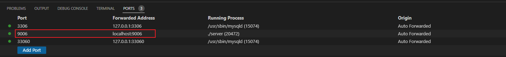

# Linux系统开发c++程序
## Linux真机环境

## WSL环境
### 环境选择

### 连接

### 连接成功

### 打开WSL-Linux上的目录
* 首先，确保在linux服务器上有一个`cpp`源代码项目，这里我在我的`code`目录下`git clone https://github.com/qinguoyi/TinyWebServer.git`克隆了一个开源项目
* 然后用`Visual Studio Code`在本地打开远程目录

* 打开后`Visual Studio Code`中显示如下

#### 测试项目环境准备
##### 安装mysql-server-8.0
项目`TinyWebServer`需要`mysql`，所以需要安装，安装命令如下：
```shell
sudo apt-get install mysql-server-8.0
```
> Ubuntu-22.04支持的mysql大版本是8
##### 检查安装后是否启动
检查`mysql-server`是否启动:`systemctl status mysql`
```shell
root@your-username:~# systemctl status mysql
● mysql.service - MySQL Community Server
     Loaded: loaded (/lib/systemd/system/mysql.service; enabled; vendor preset: enabled)
     Active: active (running) since Fri 2023-09-22 15:09:22 CST; 2min 41s ago
    Process: 15066 ExecStartPre=/usr/share/mysql/mysql-systemd-start pre (code=exited, status=0/SUCCESS)
   Main PID: 15074 (mysqld)
     Status: "Server is operational"
      Tasks: 37 (limit: 4697)
     Memory: 370.6M
     CGroup: /system.slice/mysql.service
             └─15074 /usr/sbin/mysqld

Sep 22 15:09:18 your-username systemd[1]: Starting MySQL Community Server...
Sep 22 15:09:22 your-username systemd[1]: Started MySQL Community Server.
```
##### 连接到mysql-server
```shell
root@YINC:~# mysql -u root -p
Enter password: 
Welcome to the MySQL monitor.  Commands end with ; or \g.
Your MySQL connection id is 8
Server version: 8.0.34-0ubuntu0.22.04.1 (Ubuntu)

Copyright (c) 2000, 2023, Oracle and/or its affiliates.

Oracle is a registered trademark of Oracle Corporation and/or its
affiliates. Other names may be trademarks of their respective
owners.

Type 'help;' or '\h' for help. Type '\c' to clear the current input statement.

mysql> 
```
> 如上表示连接成功，默认账号是root，默认密码为空。

##### 根据项目的指示创建相应的数据库和表
源项目地址：[https://github.com/qinguoyi/TinyWebServer](https://github.com/qinguoyi/TinyWebServer)

以下内容就是根据上面这个源项目中的`README.md`文件中的指示来运行这个项目的，另外补充了一些我在部署过程中所做的操作。
1. 建库->建表->插入一条记录
```shell
mysql> show databases;
+--------------------+
| Database           |
+--------------------+
| information_schema |
| mysql              |
| performance_schema |
| sys                |
+--------------------+
4 rows in set (0.00 sec)

mysql> create database tinywebserver_db;
Query OK, 1 row affected (0.20 sec)

mysql> use tinywebserver_db;
Database changed
mysql> create table user( username char(50) NULL, passwd char(50) NULL)ENGINE=InnoDB;
Query OK, 0 rows affected (1.24 sec)

mysql> show tables;
+----------------------------+
| Tables_in_tinywebserver_db |
+----------------------------+
| user                       |
+----------------------------+
1 row in set (0.00 sec)

mysql> insert into user(username,passwd)values('leebai','123456');
Query OK, 1 row affected (0.15 sec)

mysql> select * from user;
+----------+--------+
| username | passwd |
+----------+--------+
| leebai   | 123456 |
+----------+--------+
1 row in set (0.00 sec)
```
2. 修改源码的配置，即`main`函数中的连接配置。
    ```cpp
    //需要修改的数据库信息,登录名,密码,库名
        string user = "root";
        string passwd = "";
        string databasename = "tinywebserver_db";
    ```
3. 如果是新安装的`Ubuntu`系统，`make`与`g++`等与`c++`编译有关的工具是没有安装的，所以需要自己安装
```shell
apt-get install make

apt install build-essential
```
> build-essential：包含g++相关的工具
4. `sh ./build.sh`执行命令生成可执行文件
    * 生成过程出现`CGImysql/sql_connection_pool.cpp:1:10: fatal error: mysql/mysql.h: No such file or directory1 | #include <mysql/mysql.h>`错误，说明这个库在当前系统中没有咯
    * 执行命令`sudo apt install libmysqlclient-dev`安装即可
    * 安装完成再次执行`sh ./build.sh`
    * 若成功，会在当前目录下生成名字叫`server`的可执行文件。
5. 运行可执行文件`server`: `./server`
    
    
6. 运行成功用浏览器访问:`http://localhost:9006`
    
#### 
## Windows连接远程Linux服务器-SSH连接
