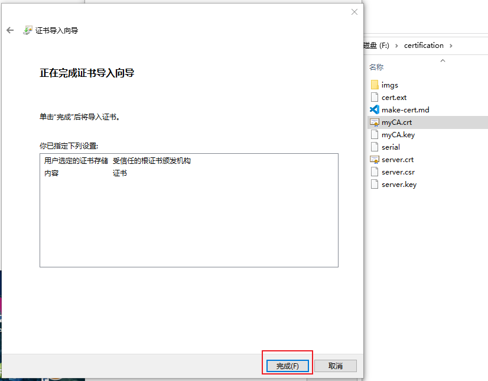

# web网站支持https | 自签名证书制作
## 简介
本文章主要演示如何使用`openssl`生成服务端证书，并部署在自己的站点上，为自己的站点提供`tls`保护。

本文主要介绍使用自签名的方式来生成证书。详细步骤请往下阅读。

## 工具准备
本文中生成证书的过程主要使用`openssl`，且本流程在`windows`平台下完成，所以去官网下载安装`openssl`即可，该过程不做演示。

## 证书生成
### CA证书
#### 生成CA私钥
执行以下命令生成`CA`私钥文件
```
openssl genrsa -des3 -out myCA.key 2048
```
> 以上命令会在当前文件所在目录生成一个名字叫`myCA.key`的`CA`私钥文件
生成结果如下：
```
PS F:\certification> openssl genrsa -des3 -out myCA.key 2048
Generating RSA private key, 2048 bit long modulus (2 primes)
.........+++++
..................................................................+++++
e is 65537 (0x010001)
Enter pass phrase for myCA.key:
Verifying - Enter pass phrase for myCA.key:
```
> 上面最后两行是设置一个打开`myCA.key`文件的密码，下一个过程要用

#### 生成CA证书
执行以下命令生成`CA`证书文件
```
openssl req -x509 -new -nodes -key myCA.key -sha256 -days 365 -out myCA.crt
```
> 365表示证书的有效期是365天
上述命令执行结束后就会出现让你自定义配置的提示，按照提示自己给出自己的配置即可,我的配置如下
```
PS F:\certification> openssl req -x509 -new -nodes -key myCA.key -sha256 -days 365 -out myCA.crt
Enter pass phrase for myCA.key:
You are about to be asked to enter information that will be incorporated
into your certificate request.
What you are about to enter is what is called a Distinguished Name or a DN.
There are quite a few fields but you can leave some blank
For some fields there will be a default value,
If you enter '.', the field will be left blank.
-----
Country Name (2 letter code) [AU]:CN
State or Province Name (full name) [Some-State]:ZJ
Locality Name (eg, city) []:HZ
Organization Name (eg, company) [Internet Widgits Pty Ltd]:ByteCannotDance
Organizational Unit Name (eg, section) []:IT
Common Name (e.g. server FQDN or YOUR name) []:leebai
Email Address []:test@gmail.com
PS F:\certification> openssl genrsa -out server.key 2048
Generating RSA private key, 2048 bit long modulus (2 primes)
...+++++
................................................................+++++
e is 65537 (0x010001)
```
> 上面出现的`Enter pass phrase for myCA.key:`提示就是让你输入章节“生成CA私钥”自己设置的密码
### 服务端证书
#### 创建服务端私钥文件
执行如下命令生成服务端私钥文件：`server.key`
```
openssl genrsa -out server.key 2048
```
执行结束，结果如下：
```
PS F:\certification> openssl genrsa -out server.key 2048
Generating RSA private key, 2048 bit long modulus (2 primes)
...+++++
................................................................+++++
e is 65537 (0x010001)
```
#### 创建服务端CSR文件
使用上面创建的服务端私钥文件创建`server.csr`文件
```
openssl req -new -key server.key -out server.csr
```
执行结束，结果如下：
```
PS F:\certification> openssl req -new -key server.key -out server.csr
You are about to be asked to enter information that will be incorporated
into your certificate request.
What you are about to enter is what is called a Distinguished Name or a DN.
There are quite a few fields but you can leave some blank
For some fields there will be a default value,
If you enter '.', the field will be left blank.
-----
Country Name (2 letter code) [AU]:CN
State or Province Name (full name) [Some-State]:ZJ
Locality Name (eg, city) []:HZ
Organization Name (eg, company) [Internet Widgits Pty Ltd]:ByteCannotDance
Organizational Unit Name (eg, section) []:IT
Common Name (e.g. server FQDN or YOUR name) []:leebai
Email Address []:test@gmail.com

Please enter the following 'extra' attributes
to be sent with your certificate request
A challenge password []:888888
An optional company name []:ByteCannotDance
```
> 以上的内容按照提示自己配置即可。
#### 创建域名附加配置文件
新建`cert.ext`文件，该文件的内容如下所示
```
authorityKeyIdentifier=keyid,issuer
basicConstraints=CA:FALSE
keyUsage = digitalSignature, nonRepudiation, keyEncipherment, dataEncipherment
subjectAltName = @alt_names

[alt_names]
DNS.1 = localhost
IP.2 = 127.0.0.1
DNS.3 = test.com
DNS.4 = *.test.com
```
#### 使用CA证书来签署服务端证书
执行以下命令会在当前目录生成服务端证书文件`server.crt`
```
openssl x509 -req -in server.csr -out server.crt -days 365 -CAcreateserial -CA myCA.crt -CAkey myCA.key -CAserial serial -extfile cert.ext
```
> 365表示证书的有效期为365天

执行结果如下：
```
PS F:\certification> openssl x509 -req -in server.csr -out server.crt -days 365 -CAcreateserial -CA myCA.crt -CAkey myCA.key -CAserial serial -extfile cert.ext
Signature ok
subject=C = CN, ST = ZJ, L = HZ, O = ByteCannotDance, OU = IT, CN = leebai, emailAddress = test@gmail.com
Getting CA Private Key
Enter pass phrase for myCA.key:
```

## 服务端程序编码
这里我主要使用`go`作为服务端程序的编码语言，并使用开源库`github.com/gin-gonic/gin`来作为服务端程序的开发框架进行开发。

服务端源码如下(`main.go`)：
```go
package main

import (
	"github.com/gin-gonic/gin"
)

func main() {
	// 配置SSL证书和私钥的文件路径
	certFile := "./tls/server.crt"
	keyFile := "./tls/server.key"

	// 创建Gin引擎
	router := gin.Default()

	// 定义路由和处理函数
	router.GET("/hello", func(c *gin.Context) {
		c.String(200, "Hello, HTTPS World!")
	})

	// 启动HTTPS服务器
	err := router.RunTLS(":446", certFile, keyFile)
	if err != nil {
		panic(err)
	}
}
```
> 上面的`./tls/server.crt`,`./tls/server.key`就是上面过程中生成的文件,直接拷贝到服务端文件`main.go`的同级目录的`tls`目录下即可。

## 效果演示一
启动服务端程序，在浏览器上使用`https://localhost:446/hello`来访问，效果如下：


若要解决该问题，请看下以章节。
## 证书安装
双击`myCA.crt`文件，安装证书即可。具体过程如下图所示。





安装完成后，访问地址`https://localhost:446/hello`，效果如下所示
