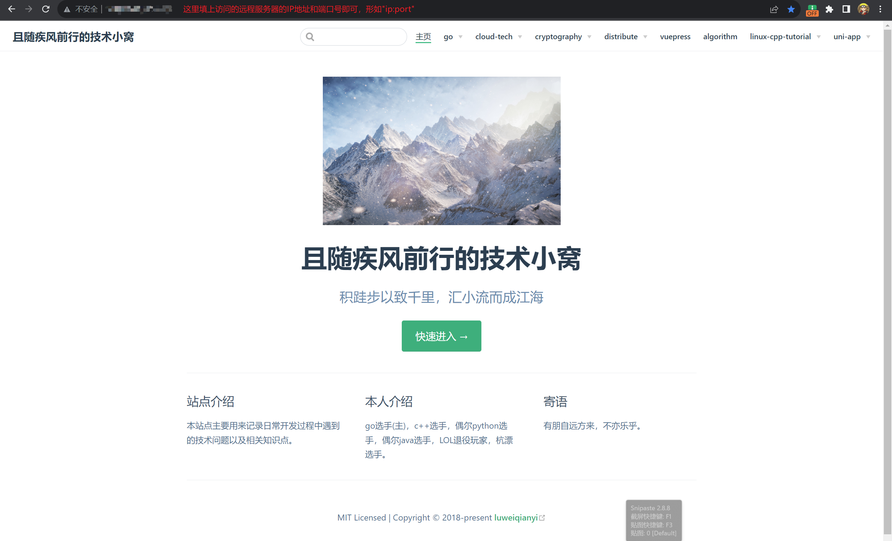

# 项目部署到远程Linux上的nginx下
步骤如下：
1. 应用打包(以本项目为例)
2. 执行命令，将本地的文件上传到远程linux服务器
    ```shell
    scp -r .\tech-website username@linux-server-ip:/usr/local/nginx/html/tech-website
    ```
    > 以上命令将当前目录下的`tech-website`目录及其下面的所有文件上传到远程服务器的`/usr/local/nginx/html/tech-website`目录，若远程`tech-website`目录不存在就会创建

    > 上面的`linux-server-ip`是远程的`linux`服务器的公网`IP`地址
3. 配置`nginx.conf`，为新的应用配置访问路径和端口。即在配置文件中加入下面这一段
    ```
        server {
            listen 8080;
            location /{
                root html/tech-website;
                index index.html;
            }
        }
    ```
    > 注意点：配置端口时注意不要发生端口冲突。
4. 配置完成后，`nginx`进程重新加载配置文件,执行命令如下：
    ```shell
    sudo ./nginx -s reload
    ```
    > 注意：一定要到`nginx`可执行文件所在路径去执行上面这条命令
5. 配置云ECS服务器的入站端口，增加`TCP:8080`端口的入站规则。因为我选择的是腾讯云的ECS服务器，所以出站规则是默认允许的，如果是阿里云的ECS服务器，可能还需要配置出站规则。
6. 配置服务器的防火墙，允许`8080`端口上有数据流量通过。我的服务器的操作系统选择的是`ubuntu`,防火墙是`ufw`。所以执行下列命令：
    ```shell
    sudo ufw allow 8080
    ``` 
7. 最终，在我的pc主机上访问：`http://linux-server-ip:8080/`,效果如下所示。
    