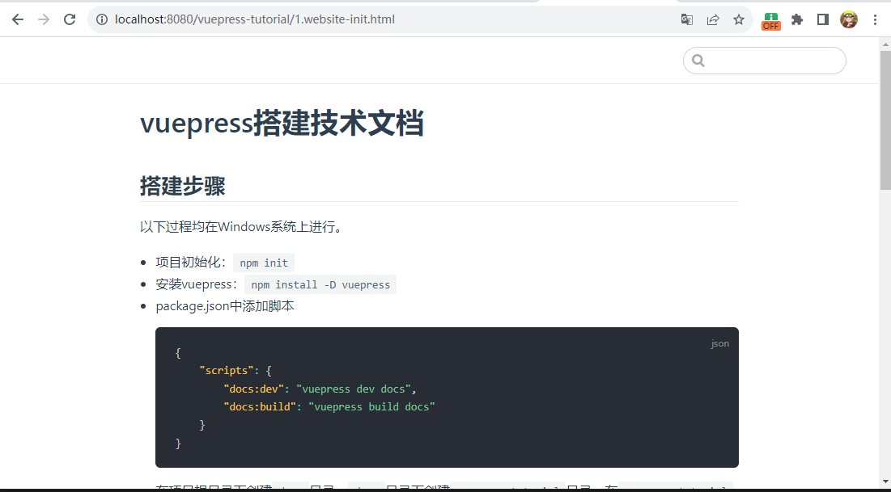

# vuepress搭建技术文档
## 搭建步骤
以下过程均在Windows系统上进行。
* 项目初始化：`npm init`
* 安装vuepress：`npm install -D vuepress`
* package.json中添加脚本
    ```json
    {
        "scripts": {
            "docs:dev": "vuepress dev docs",
            "docs:build": "vuepress build docs"
        }
    }
    ```
* 在项目根目录下创建`docs`目录，`docs`目录下创建`vuepress-tutorial`目录，在`vuepress-tutorial`目录下创建本文件，内容即本文档中的内容
* 启动项目：`npm run docs:dev`
* 使用地址`localhost:8080/vuepress-tutorial/1.website-init.html`访问，即可看到文章末尾的截图，如图所示。


## 出现的问题
1. vuepress opensslErrorStack: [ 'error:03000086:digital envelope routines::initialization error' ]
    
    解决方案：修改上面的脚本为
    ```json
    {
        "scripts": {
            "docs:dev": "set NODE_OPTIONS=--openssl-legacy-provider && vuepress dev docs",
            "docs:build": "set NODE_OPTIONS=--openssl-legacy-provider && vuepress build docs"
        }
    }
    ```
    然后重新运行命令`npm run docs:dev`启动项目

## 效果展示
