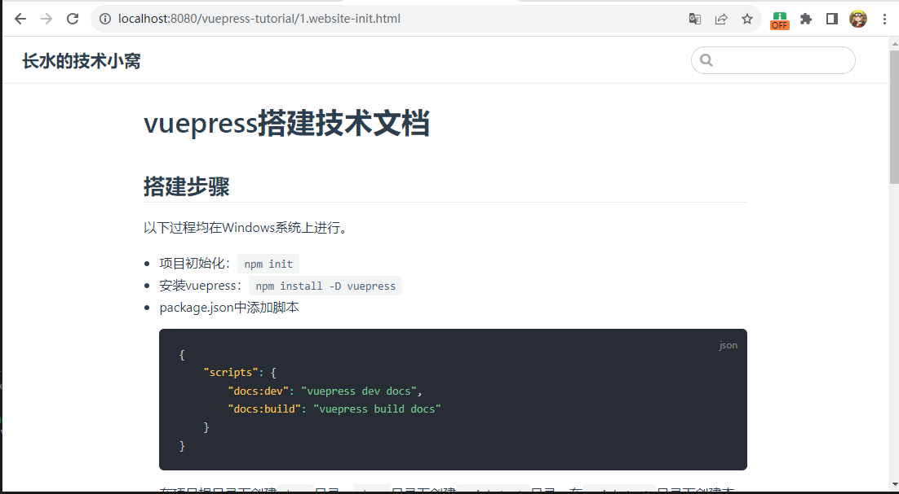
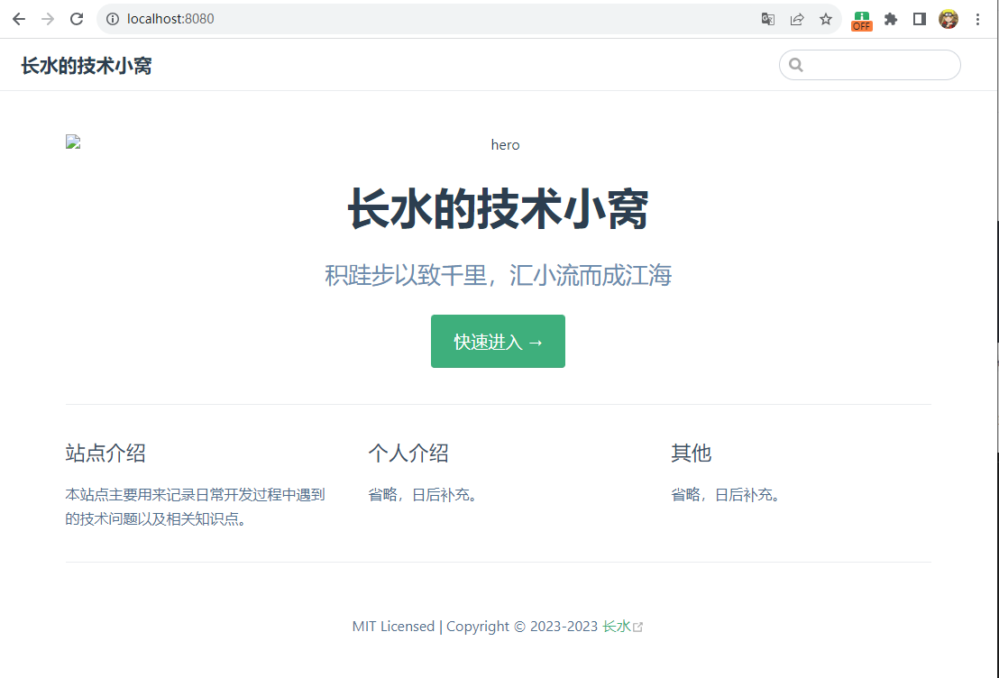
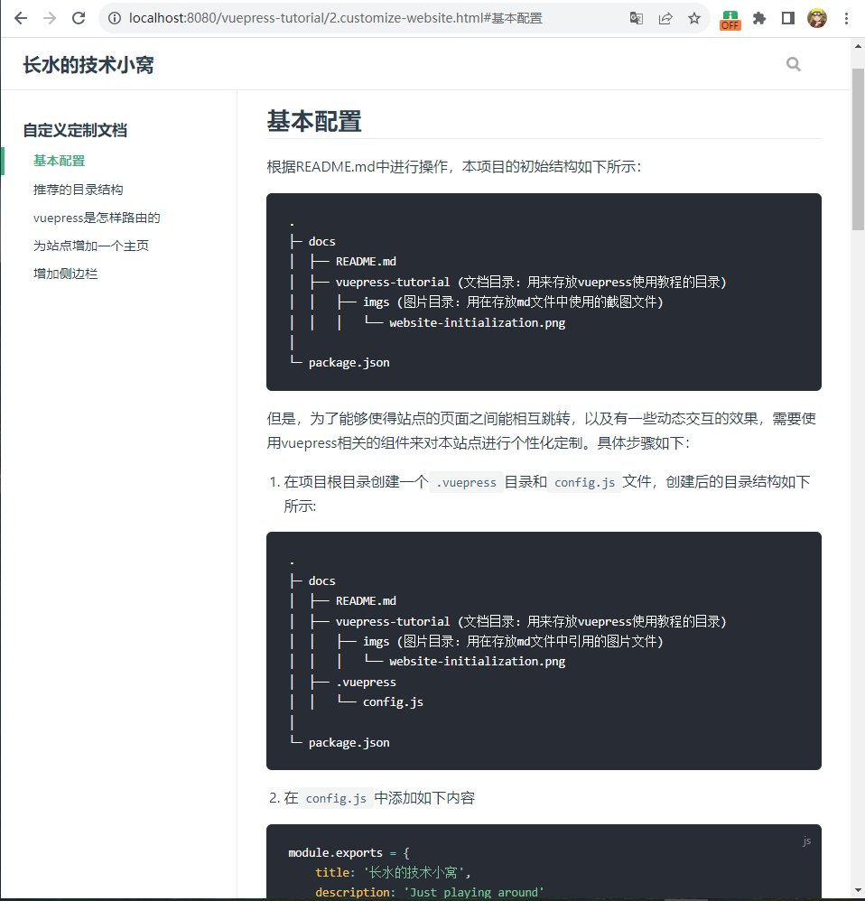
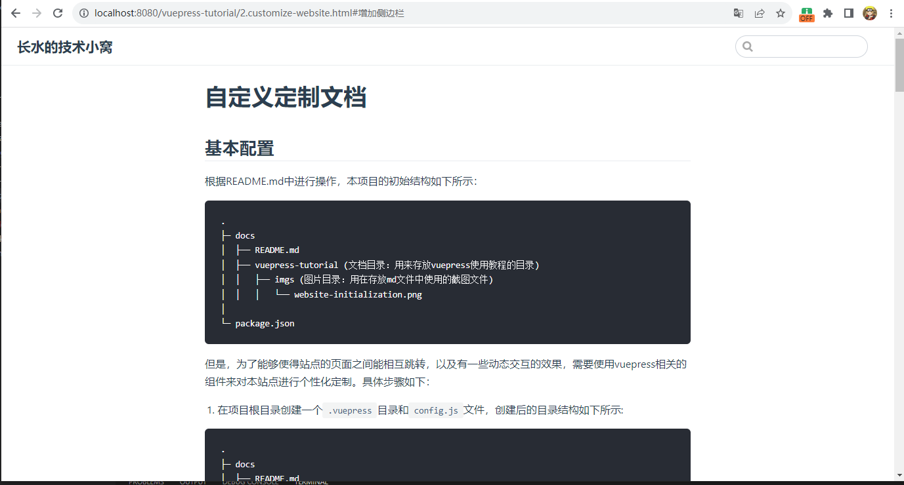

# 自定义定制文档
## 基本配置
根据README.md中进行操作，本项目的初始结构如下所示：
```cmd
.
├─ docs
│  ├── README.md
│  ├── vuepress-tutorial (文档目录：用来存放vuepress使用教程的目录)
│  │   ├── imgs (图片目录：用在存放md文件中使用的截图文件)
│  │   │   └── website-initialization.png
│
└─ package.json
```
但是，为了能够使得站点的页面之间能相互跳转，以及有一些动态交互的效果，需要使用vuepress相关的组件来对本站点进行个性化定制。具体步骤如下：
1. 在项目根目录创建一个`.vuepress`目录和`config.js`文件，创建后的目录结构如下所示:
```cmd
.
├─ docs
│  ├── README.md
│  ├── vuepress-tutorial (文档目录：用来存放vuepress使用教程的目录)
│  │   ├── imgs (图片目录：用在存放md文件中引用的图片文件)
│  │   │   └── website-initialization.png
│  ├── .vuepress
│  │   └── config.js
│
└─ package.json
```
2. 在`config.js`中添加如下内容
```js
module.exports = {
    title: '长水的技术小窝',
    description: 'Just playing around'
}
```
> 以上只是为站点指定了站点的标题。详细效果可见下文图片的左上角。
3. 重新运行启动脚本`npm run docs:dev`
4. 访问地址`localhost:8080`
5. 最终呈现的效果如下所示
    

## 推荐的目录结构
```text
.
├── docs
│   ├── .vuepress (可选的)
│   │   ├── components (可选的)
│   │   ├── theme (可选的)
│   │   │   └── Layout.vue
│   │   ├── public (可选的)
│   │   ├── styles (可选的)
│   │   │   ├── index.styl
│   │   │   └── palette.styl
│   │   ├── templates (可选的, 谨慎配置)
│   │   │   ├── dev.html
│   │   │   └── ssr.html
│   │   ├── config.js (可选的)
│   │   └── enhanceApp.js (可选的)
│   │ 
│   ├── README.md
│   ├── vuepress-tutorial
│   │   └── README.md
│   └── config.md
│ 
└── package.json
```
* `docs/.vuepress`: 用于存放全局的配置、组件、静态资源等。
* `docs/.vuepress/components`: 该目录中的 Vue 组件将会被**自动注册**为全局组件。
* `docs/.vuepress/theme`: 用于存放本地主题。
* `docs/.vuepress/styles`: 用于存放样式相关的文件。
* `docs/.vuepress/styles/index.styl`: 将会被自动应用的全局样式文件，会生成在最终的 CSS 文件结尾，具有比默认样式更高的优先级。
* `docs/.vuepress/styles/palette.styl`: 用于重写默认颜色常量，或者设置新的 stylus 颜色常量。
* `docs/.vuepress/public`: 静态资源目录。
* `docs/.vuepress/templates`: 存储 HTML 模板文件。
* `docs/.vuepress/templates/dev.html`: 用于开发环境的 HTML 模板文件。
* `docs/.vuepress/templates/ssr.html`: 构建时基于 Vue SSR 的 HTML 模板文件。
* `docs/.vuepress/config.js`: 配置文件的入口文件，也可以是 YML 或 toml。
* `docs/.vuepress/enhanceApp.js`: 客户端应用的增强。
* `vuepress-tutorial`: 自己定义存放md文件的目录, 里面可以放置自己的技术文章。

## vuepress是怎样路由的
| 文件的相对路径 | 页面路由地址 |
|-------|-------|
| /README.md | / |
| /vuepress-tutorial/README.md | /vuepress-tutorial/ |
| /vuepress-tutorial/1.website-init.md|/vuepress-tutorial/1.website-init.html|
| /config.md | /config.html |


## 为站点增加一个主页
当我们以网址`localhost:8080`访问站点时，实际上展现界面是以`README.md`文档中的内容进行展示的。因此，我们的主页配置可以添加在该文档中，修改后的`README.md`文件如下所示：
```md
---
home: true
heroImage: /vuepress-tutorial/imgs/home.jpg
heroText: 长水的技术小窝
tagline: 积跬步以致千里，汇小流而成江海
actionText: 快速进入 →
actionLink: /vuepress-tutorial/1.website-init.html
features:
- title: 站点介绍
  details: 本站点主要用来记录日常开发过程中遇到的技术问题以及相关知识点。
- title: 个人介绍
  details: 省略，日后补充。
- title: 其他
  details: 省略，日后补充。
---

::: slot footer
MIT Licensed | Copyright © 2023-2023 [长水](https://github.com/luweiqianyi)
::: 
```

其中`titie`字段和`details`字段后面再补充。最终呈现的效果如下所示：

如上图所示，可以看到存在问题：`home.jpg`图片没有加载出来,并且莫名其妙多个`hero`字段

如何解决？在`.vuepress`目录下面新建`public/images`目录，将上面的`home.jpg`图片资源放到该目录下，同时修改`README.md`文档中`heroImage`后面的值为`/images/home.jpg`即可。

重新运行`npm run docs:dev`即可查看效果。

## 增加侧边栏
主要有两个操作
1. 修改`.vuepress`目录下的`config.js`文件，增加如下内容
```js
themeConfig: {
    siderbar: 'auto'
}
```
2. 在需要侧边栏的`*.md`文档的头部增加如下格式
```text
---
sidebar: auto
---
```
这样vuepress就会自动识别，并且为文章添加侧边栏。本文章添加侧边栏后的效果如下图所示：

未加侧边栏的效果如下所示：


## 上一篇、下一篇链接
同增加侧边栏类似，先是修改`.vuepress`目录下的`config.js`文件，增加如下内容
```js
themeConfig: {
    siderbar: 'auto',
    prevLinks: true,
    nextLinks: true 
}
```
> 默认是`true`，所以不添加也行，但是可以通过设置为`false`来关闭这个选项

然后在需要使用该功能的`md`文档开头增加
```
---
prev: /vuepress-tutorial/1.website-init.html
next: false
---
```
以本文档为例，设置了其上一篇文章为`/vuepress-tutorial/1.website-init.html`该路径下的文章。

## 导航栏
如果想要将我们的vuepress-tutorial放到我们站点的导航栏，可以进行如下配置。

还是修改`.vuepress`目录下的`config.js`文件，增加
```js
themeConfig: {
    nav: [
        { text: '主页', link: '/' },
        { text: 'vuepress搭建文档教程', link: '/vuepress-tutorial/1.website-init.html' }
    ]
  }
```

## 大功告成
至此，一个简单的技术文档就搭建好了。其他额外的配置可以访问**参考链接**来对站点进行更丰富的配置。

## 参考链接
* [https://vuepress.vuejs.org/zh/theme/default-theme-config.html](https://vuepress.vuejs.org/zh/theme/default-theme-config.html)